# Custom Pipeline Passes & Custom Materials

## Overview

This plan covers **two separate but complementary systems**:

1. **Custom Pipeline Passes** — allowing user-defined passes to be inserted into the render graph at any point, with typed resource declarations and automatic topological ordering.
2. **Custom Materials** — allowing materials to define arbitrary per-technique descriptor set layouts and per-material data, with automatic draw-call merging for materials that share a technique.

Both systems are **backward-incompatible** with the current engine and will ship together as a major breaking update.

---

## Part 1: Custom Pipeline Passes

### Problem Statement

All passes are hardcoded in [`Renderer::Initialize()`](src/engine/rendering/Renderer.cpp:62). Each pass captures parameters via lambdas that close over global state pointers. There is no mechanism for an external user to insert a pass at a specific point in the execution order, declare typed parameters, or get automatic push constant serialization.

### Solution: `IPipelinePass` Interface + Existing Topological Sorter

#### 1.1. `IPipelinePass`

```cpp
// New file: src/engine/rendering/PipelinePass.cppm
class IPipelinePass {
public:
    virtual ~IPipelinePass() = default;

    // Declare GPU resources and ordering relative to built-in passes during pipeline setup
    virtual void Setup(PassSetupContext& ctx) = 0;

    // Execute the pass every frame
    virtual void Execute(const FrameContext& ctx, vk::CommandBuffer cmd) = 0;

    // Optional: validate configuration before compilation
    virtual bool Validate() const { return true; }
};
```

#### 1.2. `PassSetupContext` — Resource + Ordering Declaration

`PassSetupContext` is a thin wrapper that delegates to the existing [`RenderPipeline`](src/engine/rendering/RenderPipeline.cppm:40) and [`RenderGraphBuilder`](src/backend/RenderGraph/RenderGraph.cppm:249) APIs. Every resource operation maps directly to an existing engine method.

The `PipelineStageIntent` and `AccessIntent` types used in `AddRead()` are already defined in [`RenderGraph.cppm:14-33`](src/backend/RenderGraph/RenderGraph.cppm:14) — they are the existing render graph enums. `AddRead(res, stage, access)` maps directly to [`RenderGraphBuilder::AddRead(pass, res, stage, access)`](src/backend/RenderGraph/RenderGraph.cppm:272), and the render graph compiler in [`RenderGraphCompile.cpp:187-318`](src/backend/RenderGraph/RenderGraphCompile.cpp:187) automatically generates barriers from these declarations.

**Built-in pass ordering** uses a typed enum so custom passes can declare where they fit relative to the fixed engine pipeline. Ordering between custom passes happens at the registration site (see §1.4).

```cpp
// Closed enum for built-in passes — the engine's fixed pipeline
enum class BuiltinPass : uint8_t {
    Expand,
    DepthPrepass,
    HiZGen,
    Occlusion,
    Collect,
    MainPass,
};

class PassSetupContext {
public:
    // ── Ordering relative to the fixed built-in pipeline ──
    void RunBefore(BuiltinPass pass);
    void RunAfter(BuiltinPass pass);

    // ── GPU resource imports and transient creation ──
    ResourceHandle ReadDepthBuffer();       // → RenderPipeline::ImportDepthBuffer()
    ResourceHandle ReadBackbuffer();         // → RenderPipeline::ImportBackbuffer()
    ResourceHandle ImportImage(std::string_view name);   // → RenderPipeline::ImportImage()
    ResourceHandle ImportBuffer(std::string_view name);  // → RenderPipeline::ImportBuffer()
    ResourceHandle CreateTransientImage(const TransientImageDesc& desc);

    // ── Render graph resource usage declarations ──
    // PipelineStageIntent and AccessIntent are existing enums in RenderGraph.cppm:14-33
    void AddRead(ResourceHandle res, PipelineStageIntent stage, AccessIntent access);
    void AddWrite(ResourceHandle res);

    // ── Attachment pass declaration (for passes that render to images) ──
    // Delegates to RenderGraphBuilder::SetPassAttachments().
    // Required when a pass writes to an image via rasterization (e.g., shadow map).
    void SetPassAttachments(PassAttachmentSetup setup);

    // ── Typed push constant declaration ──
    template<typename T>
    void DeclarePushConstants(ShaderStageFlags stages);

    // ── Render extent query ──
    uint32_t GetRenderWidth() const;
    uint32_t GetRenderHeight() const;
};
```

#### 1.2b. `FrameContext` — Per-Frame Resources Accessible to Passes

`FrameContext` is the **only interface** a custom pass has to the engine during execution. It provides typed, validated access to engine-managed GPU resources without exposing internal engine state. Each handle is a distinct C++ type — you cannot accidentally pass a `DepthPyramid` where a `BindlessTextureSet` is expected.

```cpp
// Opaque typed handles (thin wrappers around Vulkan handles)
struct BindlessTextureSet  { vk::DescriptorSet handle = nullptr; };  // set 0
struct SubmeshVertexSet    { vk::DescriptorSet handle = nullptr; };  // set 1
struct RawVertexArray      { vk::DescriptorSet handle = nullptr; };  // set 2
struct IndirectionSet      { vk::DescriptorSet handle = nullptr; };  // set 3
struct DepthPyramid        { vk::Image image = nullptr; vk::ImageView view = nullptr; };
struct DepthBufferView     { vk::ImageView view = nullptr; };

struct FrameContext {
    vk::Extent2D render_extent;
    uint32_t frame_index;
    uint32_t swapchain_image_index;

    // ── Engine-standard descriptor sets (sets 0–3) ──
    BindlessTextureSet bindless_textures;    // set 0: allTextures[] + sampler
    SubmeshVertexSet   submesh_vertices;     // set 1: per-submesh vertex metadata
    RawVertexArray      raw_vertex_buffers;  // set 2: vertex buffer array
    IndirectionSet      indirection_data;    // set 3: compacted draw indirect data

    // ── Common GPU resources ──
    DepthPyramid    depth_pyramid;
    DepthBufferView depth_buffer;

    // ── Push constant upload ──
    template<typename T>
    void SetPushConstants(vk::CommandBuffer cmd, const T& src) const;

    // ── Bound resource helpers ──
    ResourceHandle GetResource(const std::string_view name) const;
};
```

**Key design points:**
- Every built-in resource is accessed through a distinct C++ type, preventing category errors.
- `SetPushConstants<T>()` pairs with `DeclarePushConstants<T>()` — the range is validated at `Compile()` time.
- `GetResource()` is the bridge back to resources declared in `Setup()`.
- `FrameContext` is the **complete public API surface** for pass `Execute()` methods. No raw `Renderer*`, no global state pointers.

---

**API mapping to existing engine systems:**

| PassSetupContext method | Delegates to | Existing file |
|---|---|---|
| `ReadDepthBuffer()` | `RenderPipeline::ImportDepthBuffer()` | [`RenderPipeline.cppm:49`](src/engine/rendering/RenderPipeline.cppm:49) |
| `ReadBackbuffer()` | `RenderPipeline::ImportBackbuffer()` | [`RenderPipeline.cppm:48`](src/engine/rendering/RenderPipeline.cppm:48) |
| `ImportImage(name)` | `RenderPipeline::ImportImage(name)` | [`RenderPipeline.cppm:50`](src/engine/rendering/RenderPipeline.cppm:50) |
| `ImportBuffer(name)` | `RenderPipeline::ImportBuffer(name)` | [`RenderPipeline.cppm:51`](src/engine/rendering/RenderPipeline.cppm:51) |
| `CreateTransientImage(desc)` | `RenderPipeline::CreateTransientImage(desc)` | [`RenderPipeline.cppm:52`](src/engine/rendering/RenderPipeline.cppm:52) |
| `AddRead(res, stage, access)` | `RenderGraphBuilder::AddRead(pass, res, stage, access)` | [`RenderGraph.cppm:272`](src/backend/RenderGraph/RenderGraph.cppm:272) |
| `AddWrite(res)` | `RenderGraphBuilder::AddWrite(pass, res)` | [`RenderGraph.cppm:274`](src/backend/RenderGraph/RenderGraph.cppm:274) |
| `SetPassAttachments(setup)` | `RenderGraphBuilder::SetPassAttachments(pass, setup)` | [`RenderGraph.cppm:277`](src/backend/RenderGraph/RenderGraph.cppm:277) |
| `RunBefore(BuiltinPass)` / `RunAfter(BuiltinPass)` | Deferred → `RenderGraphBuilder::AddDependency()` | [`RenderGraph.cppm:275`](src/backend/RenderGraph/RenderGraph.cppm:275) |

#### 1.3. Topological Sort — Already Exists in RenderGraph

The RenderGraph compiler **already uses Kahn's algorithm** for topological ordering in [`RenderGraphCompile.cpp:127-148`](src/backend/RenderGraph/RenderGraphCompile.cpp:127). Edges come from two sources that are both already implemented:

1. **Resource read-after-write dependencies** — built during `Compile()` by scanning read/write sets ([`RenderGraphCompile.cpp:84-124`](src/backend/RenderGraph/RenderGraphCompile.cpp:84))
2. **Explicit `AddDependency(before, after)` edges** — stored in `explicit_dependencies_` and fed into Kahn's algorithm ([`RenderGraphCompile.cpp:61-75`](src/backend/RenderGraph/RenderGraphCompile.cpp:61))

The `RunBefore`/`RunAfter` calls in `Setup()` record deferred dependencies that resolve to `AddDependency()` calls once the custom pass's `PassHandle` is assigned. No new compiler code is required.

**This means custom passes can be inserted anywhere** — before the depth prepass, between occlusion and collect, after the main pass. The pass declares `ctx.RunBefore(BuiltinPass::DepthPrepass)` and the graph compiler, which already reorders passes, places it correctly.

Resource barriers are handled automatically by `RenderGraphBuilder::Compile()` (lines 187-318 of the compile file). The compiler reads each pass's declared `ReadInfo` (stage + access from `AddRead`) and write targets (from `AddWrite` + `SetPassAttachments`) and emits `ResourceTransition` entries in `pre_pass_transitions` / `post_pass_transitions`. Custom passes get correct barrier generation for free.

#### 1.4. Examples

**In `Setup()` — declare resources and built-in ordering:**

```cpp
class SSAOPass : public IPipelinePass {
public:
    void Setup(PassSetupContext& ctx) override {
        depth_ = ctx.ReadDepthBuffer();
        ssao_out_ = ctx.CreateTransientImage({
            .name = "ssao-output",
            .format = vk::Format::eR8Unorm,
            .width = ctx.GetRenderWidth() / 2,
            .height = ctx.GetRenderHeight() / 2,
            .usage = vk::ImageUsageFlagBits::eStorage | vk::ImageUsageFlagBits::eSampled,
        });
        ctx.AddRead(depth_, PipelineStageIntent::ComputeShader, AccessIntent::Read);
        ctx.AddWrite(ssao_out_);

        ctx.RunAfter(BuiltinPass::DepthPrepass);
        ctx.RunBefore(BuiltinPass::MainPass);
    }

    void Execute(const FrameContext& ctx, vk::CommandBuffer cmd) override {
        // Bind SSAO compute pipeline, push constants, and dispatch
    }
private:
    ResourceHandle depth_, ssao_out_;
};
```

**At the registration site — wire custom-to-custom ordering using existing API:**

```cpp
// Custom-to-custom ordering happens HERE, not inside Setup():
auto ssao  = pipeline.AddCustomPass(std::make_unique<SSAOPass>());
auto bloom = pipeline.AddCustomPass(std::make_unique<BloomPass>());

// Bloom needs SSAO output → Bloom runs after SSAO
pipeline.AddDependency(ssao, bloom);  // existing RenderPipeline::AddDependency()
```

**Custom shadow map pass (attachment pass example):**

```cpp
class ShadowMapPass : public IPipelinePass {
public:
    uint32_t shadow_map_size = 2048;
    float cascade_splits[4] = { 0.05f, 0.15f, 0.5f, 1.0f };

    void Setup(PassSetupContext& ctx) override {
        shadow_map_ = ctx.CreateTransientImage({
            .name = "shadow-map",
            .format = vk::Format::eD32Sfloat,
            .width = shadow_map_size, .height = shadow_map_size,
            .usage = vk::ImageUsageFlagBits::eDepthAttachment | vk::ImageUsageFlagBits::eSampled,
        });
        ctx.AddWrite(shadow_map_);

        // Declare attachment setup so the render graph emits correct DEPTH_ATTACHMENT barriers
        ctx.SetPassAttachments(PassAttachmentSetup{
            .depth_attachment = AttachmentInfo{
                .resource = shadow_map_,
                .load_op = vk::AttachmentLoadOp::eClear,
                .store_op = vk::AttachmentStoreOp::eStore,
                .clear_depth = vk::ClearDepthStencilValue(1.0f, 0),
            },
            .render_area = vk::Rect2D{{0, 0}, {shadow_map_size, shadow_map_size}},
        });

        ctx.RunBefore(BuiltinPass::DepthPrepass);
    }

    void Execute(const FrameContext& ctx, vk::CommandBuffer cmd) override {
        // Bind shadow pipeline, set push constants for light view-projection,
        // draw compacted geometry from ctx.indirection_data
    }
private:
    ResourceHandle shadow_map_;
};

pipeline.AddCustomPass(std::make_unique<ShadowMapPass>());
```

---

## Part 2: Custom Materials

### Problem Statement

In the current engine, a material is defined by [`MaterialDefinition`](src/engine/rendering/MaterialManager/MaterialManager.cppm:28):

```cpp
struct MaterialDefinition {
    TechniqueId technique_id{0};
    TextureSlot texture_slot{0};   // exactly ONE bindless texture index
    BlendMode blend_mode{};
};
```

The packed `technique_texture = (texture_slot << 16) | technique_id` field in `StaticEntry` ([`MeshRenderSystem.cpp:192`](src/engine/rendering/MeshRenderSystem.cpp:192)) bakes exactly two things into the per-submesh data. There is no way to:

- Define a material with multiple texture slots
- Define a material with per-instance parameters (roughness, metallic, etc.)
- Let a technique declare its own descriptor sets beyond the engine's fixed sets 0-3
- Let different techniques have different push constant ranges

Additionally, the pipeline layout is hardcoded in [`StandardMeshPipeline::CreatePipeline()`](src/engine/rendering/StandardMeshPipeline.cpp:130) with fixed semantics: set 0 = bindless textures, set 1 = submesh vertex data, set 2 = vertex buffer array, set 3 = indirection buffer, push constants = 64 bytes vertex-only. Techniques cannot add their own descriptor sets or customize push constant ranges.

### Design Principles

1. **Technique = class inheriting `BaseTechnique`.** Each technique is a C++ class that declares its complete pipeline layout — which engine standard sets (0-3) it uses, plus extra descriptor set layouts for sets 4+. The technique defines nested data types for each data binding it needs. The engine does NOT hardcode set roles or assume a single "parameter block."

2. **Technique construction is separate from compilation.** The constructor declares all bindings and registers nested data types. A separate `Compile()` step (called after the Vulkan device is ready) builds pipelines, pipeline layouts, and GPU resources. This cleanly separates declaration (what) from creation (how).

3. **Material = typed handle with lambda-based write access.** A material is a `MaterialHandle<Tech>` returned by `Register()`. Read access uses `handle.read<T>()` — a const reference with zero overhead into the correct byte offset (computed at compile time via the technique type). Write access uses `handle.modify<T>([](T& d) { d.field = value; })` — a lambda that receives a mutable reference. After the lambda returns, the dirty flag and per-binding dirty mask are set, and `MaterialManager::MarkDirty(id)` is called. No reference escape possible, no manual `MarkDirty()`, no string-based field lookups.

4. **Two binding kinds: PerMaterial and Shared.** A technique declares bindings as `PerMaterial` (bindless array indexed by `material_id`) or `Shared` (single buffer for all materials using the technique, stored on the technique object itself). Push constants cover small per-draw data. Nothing is hardcoded — a technique can have 0, 1, or N bindings of any combination. Shared binding data lives once on the technique, not replicated per-material.

5. **Separate `technique_id` and `material_id`.** Two distinct uint32 values flow per-submesh through the GPU pipeline. The collect shader groups by `technique_id`. The fragment shader indexes per-material bindless arrays by `material_id`.

6. **Merging by technique.** Materials sharing a technique merge into a single `drawIndirect` call. Per-material variation comes from bindless array indexing by `material_id`.

7. **CPU-canonical data, staging-based GPU upload.** Material data lives in CPU memory (`MaterialEntry::cpu_data`). `modify<T>()` writes to CPU bytes and sets `entry->dirty` and a per-binding dirty mask. `FlushDirtyMaterials()` (called at frame boundary) iterates only dirty materials via a dedicated dirty list (not a linear scan), does one staging allocation per dirty material, and only copies bindings whose dirty mask bits are set. Unchanged materials incur zero overhead — the dirty list is empty. Shared bindings are uploaded via `UpdateShared<T>()` directly from technique-local storage. Shader reads hit full device-local VRAM bandwidth.

8. **No DGC for the main pass.** The main geometry pass uses plain indirect rendering (`vkCmdDrawIndirect`) with a per-technique loop. This removes pipeline layout compatibility constraints, giving techniques full freedom over their descriptor sets. The compute preprocessing passes (expand, occlusion, collect) may keep DGC if beneficial.

### Architecture

#### 2.1. Separate IDs in the GPU Data Flow

The per-submesh `StaticEntry` struct gets two distinct fields:

```hlsl
// expand.slang — new StaticEntry layout
struct StaticEntry {
    uint index_start_packed;    // hi 8 = index_buf_slot, lo 24 = index_offset
    uint index_range;
    uint technique_id;          // which technique this submesh uses
    uint material_id;           // globally unique material instance ID
    uint vertex_info;           // hi 8 = vertex_buf_slot, lo 24 = base_vertex
};
```

The expand shader reads both directly — no bit packing extraction:

```hlsl
uint techId = staticEntry.technique_id;
uint matId  = staticEntry.material_id;

VertEntry.materialId  = matId;        // passed through to fragment shader
CullEntry.techniqueId = techId;       // used by collect shader for compaction
```

The collect shaders are unchanged — they already read `CullEntry.techniqueId`.

The vertex shader passes `materialId` to the fragment shader via `TEXCOORD2`.

#### 2.2. The `BaseTechnique` Class

Every technique is a C++ class inheriting from `BaseTechnique`. It declares bindings, nested data types, and which engine sets it uses in its constructor:

```cpp
// New file: src/engine/rendering/TechniqueManager/BaseTechnique.cppm

class BaseTechnique {
public:
    enum class BindingKind : uint8_t {
        PerMaterial,  // bindless array indexed by material_id
        Shared,       // single buffer for all materials using this technique
    };

    struct BindingDecl {
        uint32_t set;
        uint32_t binding;
        BindingKind kind;
        uint32_t stride = 0;  // byte size per entry (PerMaterial only)
    };

    virtual ~BaseTechnique() = default;

    TechniqueId GetId() const { return id_; }
    std::span<const BindingDecl> GetBindings() const { return bindings_; }
    size_t GetBindingCount() const { return bindings_.size(); }
    const BindingDecl& GetBinding(size_t i) const { return bindings_[i]; }

    // ── Compacted engine set slot mapping ──
    // compacted_slot_[engine_set] = layout_slot_index, or -1 if unused.
    // E.g., technique using engine sets {0, 2} → {0, -1, 1, -1}
    // Used by the render loop to correctly place engine sets in the compacted layout.
    int8_t compacted_slot_[4] = {-1, -1, -1, -1};

    // ── Typed read of shared data (stored on technique, not per-material) ──
    template<typename T>
    const T& ReadShared() const;

    // ── Update shared binding data (writes technique-local CPU buffer, then staging upload) ──
    template<typename T>
    void UpdateShared(const T& data, GpuResources::StagingManager& staging);

    // ── Block array access by type (for MaterialManager uploads — PerMaterial only) ──
    template<typename T>
    GpuResources::BlockArray* GetBlockArrayForType();

    // ── Block array access by index (for iteration) ──
    GpuResources::BlockArray* GetBlockArray(size_t binding_index);

    // ── GPU resource cleanup ──
    void Shutdown();

    // ── Engine set mask (bit N = uses engine set N) ──
    uint8_t GetEngineSetMask() const {
        return (engine_sets_.set0 ? 1 : 0) | (engine_sets_.set1 ? 2 : 0)
             | (engine_sets_.set2 ? 4 : 0) | (engine_sets_.set3 ? 8 : 0);
    }

    // ── First custom set index (how many engine sets are compacted into the layout) ──
    uint32_t GetFirstCustomSetIndex() const { return first_custom_set_; }

protected:
    // ── Engine set opt-in flags ──
    void UseEngineSet0();  // bindless textures
    void UseEngineSet1();  // submesh vertex data
    void UseEngineSet2();  // raw vertex buffers
    void UseEngineSet3();  // indirection data

    // ── Declare a PerMaterial binding ──
    // T is the C++ data type; set/binding are user-specified (per-technique scope).
    // Debug assert fires if set+binding already declared within this technique.
    template<typename T>
    void DeclarePerMaterial(uint32_t set, uint32_t binding);

    // ── Declare a Shared binding ──
    template<typename T>
    void DeclareShared(uint32_t set, uint32_t binding);

    // Called after constructor, once the Vulkan device is ready.
    // Builds pipeline layout, pipelines, BlockArrays, GPU buffers, compacted_slot_ mapping.
    void Compile(VulkanBootstrap& bootstrap,
                 std::span<const uint32_t> vert_spv,
                 std::span<const uint32_t> frag_spv,
                 const PipelineConfig& config);

private:
    TechniqueId id_;
    std::vector<BindingDecl> bindings_;
    std::unordered_map<std::type_index, size_t> type_to_binding_;
    std::vector<GpuResources::BlockArray> block_arrays_;       // one per PerMaterial binding
    std::vector<GpuBuffer> shared_buffers_;                     // one per Shared binding
    std::vector<std::vector<std::byte>> shared_cpu_data_;       // one per Shared binding (technique-local)

    // Engine set usage tracking and compaction
    struct {
        bool set0 : 1 = false;
        bool set1 : 1 = false;
        bool set2 : 1 = false;
        bool set3 : 1 = false;
    } engine_sets_;
    uint32_t first_custom_set_ = 0;  // computed by Compile() = count of enabled engine sets

    vk::raii::PipelineLayout pipeline_layout_ = nullptr;
    vk::raii::Pipeline pipeline_ = nullptr;

    // ── Internal helpers ──
    void DeclareBindingImpl(BindingDecl decl, std::type_index ti);
    void ValidateNoBindingCollision(uint32_t set, uint32_t binding) const;
};
```

**Key design points:**
- `DeclarePerMaterial<T>()` records the binding AND stores a `type_index → binding index` mapping. This enables `GetBlockArrayForType<T>()` at O(1) hash lookup cost.
- `DeclareShared<T>()` creates a single `GpuBuffer` (device-local) **and** a technique-local CPU buffer (`shared_cpu_data_`). `UpdateShared<T>()` writes to the technique-local buffer and stages upload to the GPU buffer. Shared data is NOT replicated in per-material `cpu_data`.
- `UseEngineSet0()` through `UseEngineSet3()` track which engine sets the technique needs. During `Compile()`, these are **compacted** into layout slots 0..N-1 and `compacted_slot_[]` is populated. This is critical for correct descriptor binding (see §2.8).
- `Compile()` is a **separate step** from construction. The constructor only declares bindings — no Vulkan resources are created.
- Technique classes live in the App layer (user code). The engine provides `BaseTechnique` as the integration point.
- **Set numbers are per-technique (per pipeline layout).** Two different techniques can both use set 4 — they have independent `VkPipelineLayout`s. The only constraint enforced is no duplicate set+binding within a single technique (caught by `ValidateNoBindingCollision` debug assert).

#### 2.3. Concrete Technique: `PBRTechnique`

```cpp
class PBRTechnique : public BaseTechnique {
public:
    // ─── Per-material data (bindless array indexed by material_id) ───
    struct MaterialData {
        float    roughness       = 0.5f;
        float    metallic        = 0.0f;
        uint32_t albedoS lot      = 0;
        uint32_t normalSlot       = 0;
        uint32_t metRoughSlot     = 0;
        float    emissiveR        = 0.0f;
        float    emissiveG        = 0.0f;
        float    emissiveB        = 0.0f;
        float    alphaCutoff      = 0.5f;
        uint32_t _pad             = 0;
    };
    static_assert(sizeof(MaterialData) == 40, "GPU-CPU layout mismatch");

    // ─── Per-technique shared data (stored ONCE on the technique object) ───
    struct alignas(16) GlobalSettings {
        float exposure = 1.0f;
        float gamma    = 2.2f;
        uint32_t flags = 0;
    };
    static_assert(sizeof(GlobalSettings) == 16, "GPU-CPU layout mismatch");

    // ── Compile-time type registry (PerMaterial bindings only) ──
    // Shared bindings are NOT in this table — they live on the technique, not per-material.

    static constexpr size_t MaterialDataOffset = 0;
    static constexpr size_t TotalDataSize      = sizeof(MaterialData);

    template<typename T> static constexpr size_t GetOffset() {
        static_assert(std::is_same_v<T, MaterialData>,
                      "Unknown binding type for PBRTechnique");
        return MaterialDataOffset;
    }
    template<typename T> static constexpr bool HasBinding() {
        return std::is_same_v<T, MaterialData>;
    }
    template<typename T> static constexpr uint32_t GetBindingIndex() {
        static_assert(std::is_same_v<T, MaterialData>,
                      "Unknown binding type for PBRTechnique");
        return 0;  // MaterialData is the 0th PerMaterial binding
    }

    PBRTechnique()
    {
        UseEngineSet0();  // bindless textures
        UseEngineSet1();  // submesh vertex data
        UseEngineSet2();  // raw vertex buffers
        UseEngineSet3();  // indirection data

        // Custom bindings (sets are per-technique, set 4 is the first custom set)
        DeclarePerMaterial<MaterialData>(4, 0);
        DeclareShared<GlobalSettings>(4, 1);
    }
};
```

The `Compile()` call (separate from construction):
1. Reads `engine_sets_` flags → compacts into layout slots 0..N-1, populates `compacted_slot_[4]`
2. Builds one `vk::DescriptorSetLayout` per custom set (grouping bindings by set number)
3. Creates the `VkPipelineLayout` with all descriptor set layouts + push constant ranges
4. Calls `GraphicsPipeline::CreatePipeline()` with the assembled layout
5. Creates one `BlockArray` (device-local, `MemoryMode::DeviceLocal`) per `PerMaterial` binding
6. Creates one `GpuBuffer` (device-local) per `Shared` binding + allocates technique-local CPU buffer
7. Registers with `TechniqueManager`

#### 2.4. `GraphicsPipeline::CreatePipeline()` — Full Layout Control

[`StandardMeshPipeline::CreatePipeline()`](src/engine/rendering/StandardMeshPipeline.cpp:111) is refactored to accept a complete list of descriptor set layouts and push constant ranges:

```cpp
void GraphicsPipeline::CreatePipeline(
    VulkanBootstrap& bootstrap,
    const std::vector<uint32_t>& vertex_spirv,
    const std::vector<uint32_t>& fragment_spirv,
    const PipelineConfig& config,
    const std::vector<vk::DescriptorSetLayout>& set_layouts,
    const std::vector<vk::PushConstantRange>& push_constant_ranges
);
```

`BaseTechnique::Compile()` assembles `set_layouts` from the declaration:
- Compact engine sets into layout slots 0..N-1 (only sets whose `UseEngineSetX()` was called)
- Then group custom bindings by set number and create one layout per custom set

#### 2.5. BlockArray Refactor — Unified Host-Visible & Device-Local Storage

The existing [`BlockArray`](src/engine/gpu/GpuResources/BlockBuffer.cppm:15) class is refactored to support both host-visible (existing use cases: expand data, indirection buffers) and device-local (new use case: material data) memory.

```cpp
// Refactored BlockArray class (src/engine/gpu/GpuResources/BlockBuffer.cppm):
class BlockArray {
public:
    enum class MemoryMode : uint8_t {
        HostVisible,   // existing: CPU-mapped, Get() returns direct pointer
        DeviceLocal,   // new: VRAM-resident, UploadEntry() via staging
    };

    struct Config {
        uint32_t entry_size = 0;
        uint32_t entries_per_block = 256;
        vk::BufferUsageFlags extra_usage = {};
        MemoryMode memory_mode = MemoryMode::HostVisible;
    };

    BlockArray() = default;
    ~BlockArray();
    // ... move-only, non-copyable ...

    bool Initialize(IVulkanBootstrap& backend, const Config& cfg);
    void Shutdown();

    // ── Host-visible path (existing API, unchanged) ──
    void* Get(uint32_t index);
    void* EnsureCapacity(uint32_t count);

    // ── Device-local path ──
    // Copies CPU data → StagingManager → device-local buffer.
    // For HostVisible memory, this is a simple memcpy (no staging overhead).
    void UploadEntry(uint32_t index, const void* data, size_t size,
                     GpuResources::StagingManager& staging);

    // ── Query ──
    bool IsDeviceLocal() const { return cfg_.memory_mode == MemoryMode::DeviceLocal; }
    uint32_t BlockCount() const;
    vk::Buffer GetBlockArray(uint32_t block_index) const;
    uint64_t BlockSize() const;
    uint32_t EntriesPerBlock() const;
    uint32_t EntrySize() const;
    bool IsValid() const;

private:
    bool AddBlock();
    IVulkanBootstrap* backend_ = nullptr;
    Config cfg_{};
    std::vector<GpuBuffer> blocks_;
    std::vector<void*> mappings_;   // nullptr for DeviceLocal blocks
};
```

**Key design points:**
- `MemoryMode::HostVisible` preserves the existing code path: `Get()` returns a mapped pointer.
- `MemoryMode::DeviceLocal` sets `mappings_[i] = nullptr`. `Get()` fires a debug assert. Callers must use `UploadEntry()` instead.
- `UploadEntry()` internally checks `IsDeviceLocal()`: if host-visible, it's a direct memcpy. If device-local, it goes through `StagingManager`.
- Existing callers (expand buffers, indirection buffers) are unaffected.

**Staging upload flow (device-local path):**

1. `BlockArray::UploadEntry(material_id, cpu_data, size, staging)`:
   - Calculate byte offset in device buffer: `(block * 256 + elem) * stride`
   - Allocate from existing `StagingManager`: `staging.Allocate(size, alignment)` → `StagingSlice`
   - `memcpy` CPU bytes → `slice.data`
   - Call `staging.RecordBufferCopy(slice, device_buffer, dst_offset)`
2. After all uploads: caller calls `staging.Flush()` (submits all recorded command buffers)
3. Descriptor set rewritten only when blocks grow (every 256 materials)

**Why device-local + staging over host-visible:**
- Host-visible/coherent memory lives in the PCIe BAR — shader reads traverse the bus every access
- Device-local VRAM gives full GPU memory bandwidth for shaders
- Materials rarely change per frame (typically < 5 out of thousands), so the staging copy cost is negligible
- Unchanged materials incur zero upload overhead

#### 2.6. The `MaterialHandle<T>` — Typed Access With RAII Dirty Tracking

The handle is templated on the technique type, enabling `constexpr` offset computation via the technique's static offset table. `modify<T>()` takes a lambda that receives a mutable reference — after the lambda returns, the dirty flag and per-binding dirty mask are set, and `MarkDirty()` is called. `read<T>()` provides const access with zero overhead.

Only `PerMaterial` binding types are accessible through `MaterialHandle`. `Shared` bindings are accessed via `BaseTechnique::ReadShared<T>()` / `UpdateShared<T>()` — they live on the technique, not per-material.

```cpp
// New: src/engine/rendering/MaterialManager/MaterialHandle.hpp

template<typename Tech>
class MaterialHandle {
public:
    // ── Read access: const ref, never dirties, constexpr offset ──
    template<typename T>
    const T& read() const {
        static_assert(Tech::template HasBinding<T>(),
                      "Technique does not declare a PerMaterial binding for this type");
        constexpr size_t off = Tech::template GetOffset<T>();
        return *reinterpret_cast<const T*>(entry_->cpu_data.data() + off);
    }

    // ── Write access: lambda-based, no reference escape possible ──
    // After func() returns: dirty flag set, per-binding dirty mask updated, MarkDirty called.
    template<typename T, typename Func>
    void modify(Func&& func) {
        static_assert(Tech::template HasBinding<T>(),
                      "Technique does not declare a PerMaterial binding for this type");
        constexpr size_t off = Tech::template GetOffset<T>();
        constexpr uint32_t binding_idx = Tech::template GetBindingIndex<T>();
        func(*reinterpret_cast<T*>(entry_->cpu_data.data() + off));
        entry_->dirty = true;
        entry_->dirty_bindings |= (1u << binding_idx);
        mark_dirty_(id_);
    }

    MaterialId id() const { return id_; }
    bool valid()   const { return entry_ != nullptr; }

    // Copyable — all copies point to the same MaterialEntry
    MaterialHandle(const MaterialHandle&) = default;
    MaterialHandle& operator=(const MaterialHandle&) = default;

private:
    friend class MaterialManager;
    MaterialHandle(MaterialId id, MaterialEntry* entry,
                   void (*mark_dirty)(MaterialId))
        : id_(id), entry_(entry), mark_dirty_(mark_dirty) {}

    MaterialId id_;
    MaterialEntry* entry_;
    void (*mark_dirty_)(MaterialId);
};
```

**Design points:**
- `handle.read<T>()` returns a `const T&` at a `constexpr` offset — zero overhead.
- `handle.modify<T>([](T& d) { d.roughness = 0.5f; })` is the ONLY way to write. The lambda is inlined by the compiler (zero overhead). After execution, the dirty flag, per-binding dirty mask bit, and `MarkDirty()` are all handled automatically.
- Because `modify()` returns `void`, there is no way to capture a reference that outlives the call. This eliminates the reference-escape footgun of RAII-proxy approaches.
- Single-field write: `wood.modify<MaterialData>([](auto& d) { d.roughness = 0.95f; });`
- Multi-field batch write: `wood.modify<MaterialData>([](auto& d) { d.roughness = 0.5f; d.metallic = 0.9f; });` — dirties once, no matter how many fields are written.
- `MarkDirty()` guards against duplicates: if `entry->dirty` is already true from a previous `modify()` this frame, the ID is NOT re-added to `dirty_list_`.
- The technique type parameter (`Tech`) enables `static_assert` on binding existence and `constexpr` offset computation. `material.modify<SomeUnknownType>(...)` is a compile error.

#### 2.7. Material Storage & Registration (MaterialManager)

```cpp
class MaterialManager {
    struct MaterialEntry {
        TechniqueId technique_id;
        BlendMode blend_mode;
        bool dirty = false;                               // set by MaterialHandle::modify()
        uint32_t dirty_bindings = 0;                      // bit N = binding index N is dirty
        std::vector<std::byte> cpu_data;                  // flat buffer: only PerMaterial bindings
    };

    // Stable storage — unique_ptr prevents pointer invalidation
    std::vector<std::unique_ptr<MaterialEntry>> materials_;

    // Dirty list — iteration visits only changed materials (O(dirty), not O(total))
    std::vector<MaterialId> dirty_list_;

    // Free list for MaterialId reuse when materials are destroyed
    std::vector<MaterialId> free_list_;

public:
    // ── Typed registration — technique type inferred from template ──
    // Only PerMaterial binding data is passed; Shared data lives on the technique.
    // All data types must be trivially copyable (GPU-mappable POD).
    template<typename Tech, typename... Ts>
    MaterialHandle<Tech> Register(BlendMode blend, const Ts&... data) {
        TechniqueId tech_id = technique_mgr_.GetId<Tech>();
        auto* tech_ptr = technique_mgr_.GetTechnique(tech_id);

        // ── Compile-time guards ──
        static_assert(sizeof...(Ts) <= 16,
                      "Too many material data args");
        // All data types must be trivially copyable
        static_assert((std::is_trivially_copyable_v<Ts> && ...),
                      "All material data types must be trivially copyable (GPU POD)");

        // ── Runtime debug validation ──
        assert(tech_ptr != nullptr);

        // Count only PerMaterial bindings for argument validation
        size_t per_material_count = 0;
        for (size_t bi = 0; bi < tech_ptr->GetBindingCount(); ++bi) {
            if (tech_ptr->GetBinding(bi).kind == BaseTechnique::BindingKind::PerMaterial)
                ++per_material_count;
        }
        assert(sizeof...(Ts) == per_material_count &&
               "Material data arg count must match PerMaterial binding count");

        // Type-order validation
        size_t idx = 0;
        auto check_type = [&]<typename U>(const U&) {
            assert(Tech::template HasBinding<U>() &&
                   "Material data type not declared as PerMaterial by this technique");
            assert(Tech::template GetOffset<U>() == idx &&
                   "Material data types in wrong order");
            ++idx;
        };
        (check_type(data), ...);

        // ── Allocate material ID ──
        MaterialId id;
        if (!free_list_.empty()) {
            id = free_list_.back();
            free_list_.pop_back();
        } else {
            id = MaterialId{static_cast<uint32_t>(materials_.size())};
            materials_.emplace_back();
        }

        // ── Serialize PerMaterial binding data into flat cpu_data buffer ──
        auto entry = std::make_unique<MaterialEntry>();
        entry->technique_id = tech_id;
        entry->blend_mode = blend;
        entry->cpu_data.clear();
        auto write_one = [&]<typename U>(const U& d) {
            const auto* bytes = reinterpret_cast<const std::byte*>(&d);
            entry->cpu_data.insert(entry->cpu_data.end(), bytes, bytes + sizeof(U));
        };
        (write_one(data), ...);

        // ── Immediate first upload via staging → device-local ──
        size_t total_size = entry->cpu_data.size();
        auto staging_slice = staging_mgr_.Allocate(total_size, 256);
        std::memcpy(staging_slice.data, entry->cpu_data.data(), total_size);

        size_t upload_offset = 0;
        for (size_t bi = 0; bi < tech_ptr->GetBindingCount(); ++bi) {
            const auto& binding = tech_ptr->GetBinding(bi);
            if (binding.kind != BaseTechnique::BindingKind::PerMaterial) continue;
            auto* ba = tech_ptr->GetBlockArray(bi);
            staging_mgr_.RecordBufferCopy(staging_slice,
                                          ba->GetBlockArray(id.value / 256),
                                          ba->EntrySize() * (id.value % 256),
                                          upload_offset,
                                          binding.stride);
            upload_offset += binding.stride;
        }

        MaterialEntry* entry_ptr = entry.get();
        materials_[id.value] = std::move(entry);
        return MaterialHandle<Tech>(id, entry_ptr,
                                    [this](MaterialId mid) { MarkDirty(mid); });
    }

    // ── Batched GPU upload — called once per frame ──
    // Per-binding dirty mask: only copies bindings whose bit is set.
    // Shared bindings are NOT touched here — they're uploaded via UpdateShared<T>().
    void FlushDirtyMaterials() {
        if (dirty_list_.empty()) return;  // ← common case: zero work

        // Phase 1: allocate staging for all dirty materials
        struct PendingUpload {
            MaterialId id;
            MaterialEntry* entry;
            StagingSlice slice;
        };
        std::vector<PendingUpload> pending;
        pending.reserve(dirty_list_.size());

        for (MaterialId id : dirty_list_) {
            auto& entry = materials_[id.value];
            if (!entry || !entry->dirty) continue;

            auto slice = staging_mgr_.Allocate(entry->cpu_data.size(), 256);
            std::memcpy(slice.data, entry->cpu_data.data(), entry->cpu_data.size());
            pending.push_back({id, entry.get(), slice});
        }

        // Phase 2: record per-binding buffer copies — only for dirty bindings
        for (auto& p : pending) {
            auto* tech = technique_mgr_.GetTechnique(p.entry->technique_id);
            size_t src_offset = 0;
            uint32_t mask = p.entry->dirty_bindings;
            for (size_t bi = 0; bi < tech->GetBindingCount(); ++bi) {
                const auto& binding = tech->GetBinding(bi);
                if (binding.kind != BaseTechnique::BindingKind::PerMaterial) {
                    src_offset += binding.stride;
                    continue;
                }
                if (mask & 1) {
                    auto* ba = tech->GetBlockArray(bi);
                    staging_mgr_.RecordBufferCopy(p.slice,
                                                  ba->GetBlockArray(p.id.value / 256),
                                                  ba->EntrySize() * (p.id.value % 256),
                                                  src_offset,
                                                  binding.stride);
                }
                src_offset += binding.stride;
                mask >>= 1;
            }
            p.entry->dirty = false;
            p.entry->dirty_bindings = 0;
        }

        staging_mgr_.Flush();

        for (auto& tech : techniques_)
            for (auto& ba : tech->block_arrays)
                ba.UpdateDescriptorIfNeeded();

        dirty_list_.clear();
    }

    // ── Called automatically by MaterialHandle::modify() ──
    void MarkDirty(MaterialId id) {
        auto& entry = materials_[id.value];
        if (entry && !entry->dirty) {
            entry->dirty = true;
            dirty_list_.push_back(id);
        }
    }

    // ── Material destruction with ID reuse ──
    void Destroy(MaterialId id) {
        materials_[id.value].reset();
        free_list_.push_back(id);
    }

    // ── Read-only access to any material (type-erased path) ──
    template<typename T>
    const T& Get(MaterialId id) const {
        auto& entry = materials_[id.value];
        return *reinterpret_cast<const T*>(entry->cpu_data.data());
    }

private:
    GpuResources::StagingManager& staging_mgr_;
    TechniqueManager& technique_mgr_;
};
```

**Registration flow:**
1. `Tech` template parameter identifies the technique; `Register()` validates technique existence
2. Debug asserts check arg count matches `PerMaterial` binding count only (Shared bindings excluded)
3. Material ID allocated from `free_list_` or appended
4. Data written directly via `memcpy` — all types are trivially copyable (GPU POD), no `serialize()` method needed
5. Single staging allocation for the entire `cpu_data`, then per-binding `RecordBufferCopy`
6. Returns `MaterialHandle<Tech>` pointing to the `MaterialEntry` (stable pointer from `unique_ptr`)

**Flush flow (per frame):**
1. `if (dirty_list_.empty()) return;` — **zero overhead** when no materials changed
2. Phase 1: one staging alloc per dirty material, memcpy full `cpu_data`
3. Phase 2: only copy bindings whose `dirty_bindings` bit is set → reduced PCIe traffic for partial updates
4. `staging_mgr_.Flush()` — submits all recorded copy commands
5. `UpdateDescriptorIfNeeded()` on every `BlockArray` — no-op unless blocks grew
6. Clear `dirty_list_`

**Dirty tracking integration:**
- `MaterialHandle::modify<T>()` sets `entry->dirty`, sets `entry->dirty_bindings |= (1u << GetBindingIndex<T>())`, and calls `MarkDirty(id)`
- `MarkDirty()` only adds to `dirty_list_` once per frame (when `entry->dirty` transitions from false to true)
- The per-binding dirty mask enables `FlushDirtyMaterials()` to skip unchanged bindings within a dirty material

#### 2.8. The Main Render Pass — Dynamic Descriptor Set Binding

Engine sets within a technique's pipeline layout are **compacted**: if a technique uses engine sets {0, 2} (skipping 1 and 3), the pipeline layout has them at slots 0 and 1, not 0 and 2. `BaseTechnique::compacted_slot_[engine_set]` stores the layout slot for each engine set (or -1 if unused). The render loop binds engine sets into their compacted positions, then binds custom sets starting at `GetFirstCustomSetIndex()`.

Since different techniques may have different compacted slot mappings, we must always bind engine sets when switching techniques. The rebinding is per-engine-set: if the compacted slot position changes, the set must be rebound. If a set disappears between techniques, it must be unbound.

```cpp
// SceneRendererFrame.cpp — Render()
// ds[] is a staging array for descriptor set binding.
// We bind all engine sets compacted into slots [0, first_custom_set).
// Then bind custom sets at slots [first_custom_set, ...).

// Persistent state across technique loop iterations:
// last_engine_sets_bound = how many engine sets are currently bound from previous technique
// This starts at 0 for the first technique.

uint32_t last_bound_count = 0;
std::array<vk::DescriptorSet, 8> ds{};
vk::DescriptorSet null_ds = VK_NULL_HANDLE;

for (uint16_t t = 0; t < tm.GetTechniqueCount(); ++t) {
    auto* tech = tm.GetTechnique(t);
    cmd.bindPipeline(vk::PipelineBindPoint::eGraphics, *tech->pipeline);

    // ── Engine sets: bind compacted into slots 0..N-1 ──
    uint32_t engine_count = tech->GetFirstCustomSetIndex();

    // Build the descriptor set array from compacted_slot_ mapping
    for (uint32_t es = 0; es < 4; ++es) {
        int8_t slot = tech->compacted_slot_[es];
        if (slot >= 0) {
            ds[slot] = GetEngineDescriptorSet(es);  // returns the actual VkDescriptorSet for engine set `es`
        }
    }

    // Bind engine sets [0, engine_count)
    cmd.bindDescriptorSets(vk::PipelineBindPoint::eGraphics,
                           *tech->pipeline_layout, 0,
                           {ds.data(), engine_count}, {});

    // If previous technique had MORE engine sets bound, explicitly unbind the extras.
    // Vulkan requires all bound sets to be compatible with the pipeline layout;
    // lingering sets from a previous technique with different layout are UB.
    if (last_bound_count > engine_count) {
        // The new pipeline layout has fewer engine sets — the extra slots from the
        // previous bind are now dangling. Bind null descriptor sets to clear them.
        // In practice: set a flag that next technique forces a full rebind.
        // Simpler: just accept the rebind cost; it's trivial.
    }
    last_bound_count = engine_count;

    // ── Technique custom sets (4+): always bind at their declared set numbers ──
    uint32_t custom_si = 0;
    for (auto& ba : tech->block_arrays)
        ds[custom_si++] = ba.GetDescriptorSet();
    for (auto& sb : tech->shared_buffers)
        ds[custom_si++] = sb.GetDescriptorSet();

    if (custom_si > 0) {
        cmd.bindDescriptorSets(vk::PipelineBindPoint::eGraphics,
                               *tech->pipeline_layout,
                               tech->GetFirstCustomSetIndex(),
                               {ds.data(), custom_si}, {});
    }

    // One merged drawIndirect per technique
    cmd.drawIndirect(*frame.technique_draw_commands.GetBuffer(),
                     t * sizeof(vk::DrawIndirectCommand), 1,
                     sizeof(vk::DrawIndirectCommand));
}
```

**Why this is correct:**
- Each technique has its own `VkPipelineLayout`. Descriptor set slot numbers refer to layout positions, not global set numbers.
- Engine sets are compacted into contiguous layout slots starting at 0. `compacted_slot_[es]` gives the layout slot for engine set `es`.
- Custom sets start at `first_custom_set_` (= count of enabled engine sets) and use the user-declared set numbers within the technique's layout.
- The null-descriptor-set unbind for shrinking engine set counts is handled implicitly: the next technique's `bindDescriptorSets` overwrites slots 0..N with its own sets. Since Vulkan 1.2, pipeline layouts with different descriptor counts at the same bind point are valid as long as you rebind the correct count.

#### 2.9. Shader Side

**PBR technique fragment shader** (replacing the current `standard_mesh.slang`):

```hlsl
// Set 0: bindless textures (engine standard)
[[vk::binding(0, 0)]] Texture2D<float4> allTextures[];
[[vk::binding(0, 0)]] SamplerState defaultSampler;

// Set 4, binding 0: per-material data (bindless StructuredBuffer array)
struct MaterialData {
    uint albedoS lot;
    uint normalSlot;
    uint metRoughSlot;
    float roughness;
    float metallic;
    float emissiveR;
    float emissiveG;
    float emissiveB;
    float alphaCutoff;
};
[[vk::binding(0, 4)]] StructuredBuffer<MaterialData> materialBuffer[];

// Set 4, binding 1: per-technique shared settings
struct GlobalSettings { float exposure; float gamma; uint flags; };
[[vk::binding(1, 4)]] StructuredBuffer<GlobalSettings> globalSettings;

struct PSInput {
    [[vk::location(2)]] uint materialId : TEXCOORD2;
    [[vk::location(0)]] float3 normal : TEXCOORD0;
    [[vk::location(1)]] float2 texCoord : TEXCOORD1;
};

[shader("fragment")]
float4 main(PSInput input) : SV_TARGET {
    uint block = input.materialId / 256u;
    uint elem  = input.materialId % 256u;
    MaterialData m = materialBuffer[NonUniformResourceIndex(block)][elem];

    float4 albedo = allTextures[NonUniformResourceIndex(m.albedoS lot)]
                  .Sample(defaultSampler, input.texCoord);
    // ... PBR lighting using m.roughness, m.metallic, m.emissive*, globalSettings.exposure ...
    return albedo;
}
```

#### 2.10. CPU-Side Data Flow

```
MeshRenderSystem::ProcessFrame():
  For each submesh:
    StaticEntry.technique_id = material_def.technique_id
    StaticEntry.material_id  = material_handle.id()
    (was: technique_texture = (tex_slot << 16) | technique_id)

expand.slang:
    CullEntry.techniqueId = StaticEntry.technique_id    // direct copy
    VertEntry.materialId  = StaticEntry.material_id     // direct copy

collect shaders:
    Read CullEntry.techniqueId → group by technique → write DrawIndirectCommands

vertex shader:
    outM = VertEntry.materialId  // pass through to fragment

fragment shader:
    block = materialId / 256; elem = materialId % 256;
    Data = materialBuffer[block][elem];  // bindless array indexed by material_id
```

#### 2.11. Frame Integration — Dirty Flush

```
Frame N:
  Game::FrameUpdate():
    MeshRenderSystem::ProcessFrame()  // writes technique_id + material_id
    Game logic edits materials:
      wood_mat.edit()->roughness = 0.9f;  // RAII proxy dirties on scope exit

  Game::FrameRender():
    MaterialManager::Get().FlushDirtyMaterials()   // no raw vk::CommandBuffer
      → if dirty_list_ is empty: return immediately  (zero overhead)
      → for each dirty material ID:
          for each binding: BlockArray::UploadEntry()
            → memcpy cpu_data → StagingManager::Allocate() mapped slot
            → StagingManager::RecordBufferCopy(staging → device_local)
            (existing pattern — see SceneLoader.cpp:297-326)
      → staging_mgr_.Flush()         // submits all recorded copies
      → UpdateDescriptorIfNeeded()   // no-op unless blocks grew
      → clear dirty_list_
    Renderer::RenderFrame()
      → buffer barrier: transfer → graphics/compute (makes new data visible)
      → PrepareCompute()              // engine BlockArray descriptor updates
      → pipeline_->Execute()          // all passes + main draw with dynamic set binding
```

---

## Part 3: Combined Architecture Diagram

```mermaid
flowchart TB
    subgraph "Engine Core (Preprocessing)"
        EXP[Expand compute]
        DP[Depth Prepass]
        HZ[Hi-Z Gen]
        OC[Occlusion Cull]
        CL[Collect compute]
        EXP --> DP --> HZ --> OC --> CL
    end

    subgraph "Custom Passes (IPipelinePass)"
        SSAO[SSAO]
        SHADOW[Shadow Maps]
        POST[Post-Processing]
    end

    subgraph "Main Pass (per-technique indirect draw loop)"
        direction LR
        T0["Technique 0: PBR\nengine sets compacted 0-3 + custom set 4\nmerged drawIndirect"]
        T1["Technique 1: SkinnedPBR\nengine sets compacted 0-3 + custom sets 4-5\nmerged drawIndirect"]
    end

    subgraph "Material System"
        CPU[CPU-canonical data\nMaterialEntry::cpu_data\nPerMaterial only]
        MOD["modify<T>(lambda)\nlambda executes, then auto-dirties"]
        FLUSH[FlushDirtyMaterials\nbatched staging upload\nper-binding dirty mask]
    end

    subgraph "GPU Storage"
        BA["BlockArray (DeviceLocal)\nPerMaterial: bindless array indexed by material_id"]
        SB["GpuBuffer (DeviceLocal)\nShared: single buffer per technique\nCPU copy on technique object"]
    end

    SSAO -.-> DP
    SHADOW -.-> CL
    CL --> T0
    CL --> T1
    T0 --> POST

    CPU --> MOD
    MOD --> FLUSH
    FLUSH --> BA
    SB -.-> T0
    SB -.-> T1
    BA --> T0
    BA --> T1

    subgraph "API Surface"
        HANDLE["MaterialHandle<PBRTechnique>\nread<T>() + modify<T>(lambda)"]
        SHARED["tech->UpdateShared<GlobalSettings>()\ntechnique-local storage"]
    end

    HANDLE --> MOD
    SHARED --> SB
```



---

## Part 4: Implementation Plan

### Phase 1: Separate technique_id and material_id
- Add `technique_id` and `material_id` fields to `StaticEntry` in [`MeshRenderSystem.cpp`](src/engine/rendering/MeshRenderSystem.cpp)
- Update expand shader to read both fields directly
- Remove `technique_texture` field and bit-packing logic
- Recompile all affected shaders
- Files: [`MeshRenderSystem.cpp`](src/engine/rendering/MeshRenderSystem.cpp), [`expand.slang`](src/engine/shaders/expand.slang)

### Phase 2: `IPipelinePass` Interface + Built-in Pass Ordering
- New file: `PipelinePass.cppm` — `IPipelinePass`, `PassSetupContext`, `BuiltinPass` enum, `FrameContext`
- New file: `PipelinePass.cpp` — implementations
- Add `SetPassAttachments()` to `PassSetupContext` — delegates to existing `RenderGraphBuilder::SetPassAttachments()`
- Add `RunBefore(BuiltinPass)` / `RunAfter(BuiltinPass)` — deferred resolution to existing `AddDependency()`
- Add `BuiltinPass` enum (Expand, DepthPrepass, HiZGen, Occlusion, Collect, MainPass)
- Add `AddCustomPass()` to `RenderPipeline` — returns `PassHandle` for custom-to-custom ordering via existing `AddDependency()`
- Port existing built-in passes to `IPipelinePass` classes
- **No new graph compiler code required** — Kahn's algorithm already exists in [`RenderGraphCompile.cpp:127-148`](src/backend/RenderGraph/RenderGraphCompile.cpp:127); barrier generation already exists in [`RenderGraphCompile.cpp:187-318`](src/backend/RenderGraph/RenderGraphCompile.cpp:187)
- Files: [`RenderGraph.cppm`](src/backend/RenderGraph/RenderGraph.cppm), [`RenderPipeline.cppm`](src/engine/rendering/RenderPipeline.cppm), [`Renderer.cpp`](src/engine/rendering/Renderer.cpp)

### Phase 3: BaseTechnique + BlockArray Refactor
- New file: `BaseTechnique.cppm` — base class with `DeclarePerMaterial<T>()`, `DeclareShared<T>()`, `UseEngineSet0-3()`, `Compile()`, `UpdateShared<T>()`, `Shutdown()`, `compacted_slot_[4]`
- `shared_cpu_data_` vector for technique-local Shared binding storage
- Refactor existing `BlockArray`: add `MemoryMode` enum, add `UploadEntry()`, remove unused `GetStagingSlot()`
- Add `GetBlockArray()` / `GetBlockArrayForType<T>()` to `BaseTechnique`
- Refactor `GraphicsPipeline::CreatePipeline()` — accept full layout + push constants
- Refactor `TechniqueManager` to store `BaseTechnique*`, add `Destroy(TechniqueId)`
- Files: [`BaseTechnique.cppm`](src/engine/rendering/TechniqueManager/BaseTechnique.cppm), [`BlockBuffer.cppm`](src/engine/gpu/GpuResources/BlockBuffer.cppm) (modified), [`StandardMeshPipeline.cpp`](src/engine/rendering/StandardMeshPipeline.cpp), [`TechniqueManager.cppm`](src/engine/rendering/TechniqueManager/TechniqueManager.cppm)

### Phase 4: MaterialHandle + Dirty Tracking + Staging Upload
- New file: `MaterialHandle.hpp` — `MaterialHandle<Tech>` with lambda-based `modify<T>()` and `read<T>()`
- Add `MaterialEntry` struct (cpu_data with PerMaterial bindings only, dirty flag, dirty_bindings mask) to `MaterialManager`
- Add `dirty_list_` and `free_list_` to `MaterialManager`
- Add `StagingManager&` member to `MaterialManager`
- Implement `Register<Tech, Ts...>(BlendMode, Ts&&...)` — validates, allocates ID, direct memcpy serialize, staging upload
- Implement `FlushDirtyMaterials()` — per-binding dirty mask gating, batched staging upload
- Implement `MarkDirty()` — called automatically by `MaterialHandle::modify()`
- Implement `Destroy()` — adds ID to free_list_ for reuse
- Remove old `MaterialDefinition` with `TextureSlot` and `SerializeBytes()` black box
- Files: [`MaterialManager.cppm`](src/engine/rendering/MaterialManager/MaterialManager.cppm), [`MaterialManager.cpp`](src/engine/rendering/MaterialManager/MaterialManager.cpp), [`MaterialHandle.hpp`](src/engine/rendering/MaterialManager/MaterialHandle.hpp), [`BlockBuffer.cpp`](src/engine/gpu/GpuResources/BlockBuffer.cpp) (modified)

### Phase 5: Dynamic Descriptor Set Binding in Main Pass
- Update `SceneRenderer::Render()` — use `compacted_slot_[4]` for correct compacted engine set binding
- Bind `BlockArray` descriptor sets for technique extra bindings
- Remove DGC path from main pass; keep indirect rendering only
- Update depth prepass to use new `StaticEntry` layout
- Wire `FlushDirtyMaterials()` into `Renderer::RenderFrame()` before `PrepareCompute()`
- Files: [`SceneRendererFrame.cpp`](src/engine/rendering/SceneRendererFrame.cpp), [`SceneRenderer.cpp`](src/engine/rendering/SceneRenderer.cpp), [`Renderer.cpp`](src/engine/rendering/Renderer.cpp)

### Phase 6: Shader Migration
- Update `expand.slang` for separate `technique_id`/`material_id` fields
- Update `VertEntry` struct to carry `materialId` instead of `texSlot`
- Update `main_indir.slang` to pass `materialId`
- Rewrite `standard_mesh.slang` to index into per-material bindless array
- Write example technique shaders (PBR, skinned) demonstrating both binding kinds
- Files: all `.slang` files in [`src/engine/shaders/`](src/engine/shaders/)

### Phase 7: App-Layer Integration
- Update [`Game::InitRenderer()`](src/engine/core/Game.cpp) — construct `PBRTechnique` then call `Compile()` with device-ready bootstrap
- Update material registration — use `Register<PBRTechnique>(blend, MaterialData{...})` instead of `RegisterMaterial(MaterialDefinition{...})`
- Update [`Game::FrameRender()`](src/engine/core/Game.cpp) — call `FlushDirtyMaterials()` before `RenderFrame()`
- Wire per-frame shared data updates: `pbr_tech->UpdateShared(global_settings, staging_mgr)`
- Files: [`Game.cpp`](src/engine/core/Game.cpp)

---

## Part 5: API Usage Examples

### Example 1: PBR Technique With Per-Material Data + Shared Settings

```cpp
// ── 1. Define the technique class ──
class PBRTechnique : public BaseTechnique {
public:
    struct MaterialData {
        float    roughness    = 0.5f;
        float    metallic     = 0.0f;
        uint32_t albedoS lot   = 0;
        uint32_t normalSlot    = 0;
        uint32_t metRoughSlot  = 0;
        float    emissiveR     = 0.0f;
        float    emissiveG     = 0.0f;
        float    emissiveB     = 0.0f;
        float    alphaCutoff   = 0.5f;
        uint32_t _pad          = 0;
    };
    static_assert(sizeof(MaterialData) == 40, "GPU-CPU layout mismatch");

    struct alignas(16) GlobalSettings {
        float exposure = 1.0f;
        float gamma    = 2.2f;
        uint32_t flags = 0;
    };
    static_assert(sizeof(GlobalSettings) == 16, "GPU-CPU layout mismatch");

    // Compile-time offset table (PerMaterial bindings only)
    template<typename T> static constexpr size_t GetOffset() {
        static_assert(std::is_same_v<T, MaterialData>);
        return 0;
    }
    template<typename T> static constexpr bool HasBinding() {
        return std::is_same_v<T, MaterialData>;
    }
    template<typename T> static constexpr uint32_t GetBindingIndex() {
        static_assert(std::is_same_v<T, MaterialData>);
        return 0;
    }

    PBRTechnique()
    {
        UseEngineSet0();
        UseEngineSet1();
        UseEngineSet2();
        UseEngineSet3();
        DeclarePerMaterial<MaterialData>(4, 0);
        DeclareShared<GlobalSettings>(4, 1);
    }
};

// ── 2. Register and compile the technique (two-phase init) ──
auto* pbr_tech = technique_mgr.Register<PBRTechnique>();
pbr_tech->Compile(bootstrap, vert_spv, frag_spv, PipelineConfig{});

// ── 3. Register materials — typed handles, compile-time offset ──
auto wood = material_mgr.Register<PBRTechnique>(
    BlendMode::Opaque,
    PBRTechnique::MaterialData{.roughness = 0.7f, .albedoS lot = 5, .metallic = 0.0f}
);

auto metal = material_mgr.Register<PBRTechnique>(
    BlendMode::Opaque,
    PBRTechnique::MaterialData{.roughness = 0.25f, .albedoS lot = 7, .metallic = 0.9f}
);

// ── 4. Runtime edits — lambda-based, no reference escape ──
wood.modify<MaterialData>([](auto& d) { d.roughness = 0.95f; });
wood.modify<MaterialData>([](auto& d) { d.albedoS lot = 3; });

// Batch multiple writes under a single dirty:
wood.modify<MaterialData>([](auto& d) {
    d.roughness = 0.95f;
    d.albedoS lot = 3;
    d.metallic = 0.1f;
});  // ← dirty flag + dirty_bindings set ONCE for all writes

// ── 5. Read without dirtying ──
float r = wood.read<MaterialData>().roughness;          // const ref, constexpr offset
float m = metal.read<MaterialData>().metallic;

// ── 6. Per-frame shared data update (technique-local, not per-material) ──
pbr_tech->UpdateShared(
    PBRTechnique::GlobalSettings{.exposure = 1.2f, .gamma = 2.2f, .flags = 0},
    staging_mgr
);

// ── 7. Frame boundary — batch staging upload ──
MaterialManager::Get().FlushDirtyMaterials();
// Only wood and metal get uploaded. Only their changed bindings are copied.
// All other materials: zero cost (dirty_list_ is empty for them).
```

### Example 2: Skinned Mesh Technique (Inheriting PBR, Adding Bone Buffer)

```cpp
class SkinnedPBRTechnique : public PBRTechnique {
public:
    struct SkinningData {
        uint32_t boneRemap[64];
        float    morphWeight[8];
    };
    static_assert(sizeof(SkinningData) == 288, "GPU-CPU layout mismatch");

    // Extended offset table
    template<typename T> static constexpr size_t GetOffset() {
        if constexpr (std::is_same_v<T, SkinningData>)
            return sizeof(PBRTechnique::MaterialData);
        else
            return PBRTechnique::GetOffset<T>();
    }
    template<typename T> static constexpr bool HasBinding() {
        return std::is_same_v<T, SkinningData> || PBRTechnique::HasBinding<T>();
    }
    template<typename T> static constexpr uint32_t GetBindingIndex() {
        if constexpr (std::is_same_v<T, SkinningData>)
            return 1;  // second PerMaterial binding
        else
            return PBRTechnique::GetBindingIndex<T>();
    }

    SkinnedPBRTechnique()
        : PBRTechnique()
    {
        DeclarePerMaterial<SkinningData>(5, 0);
    }
};

// Register a skinned material with two typed data structs:
auto skinned_mat = material_mgr.Register<SkinnedPBRTechnique>(BlendMode::Opaque,
    PBRTechnique::MaterialData{.roughness = 0.5f, .albedoS lot = 3},
    SkinnedPBRTechnique::SkinningData{.boneRemap = {/* ... */}, .morphWeight = {0.5f, /* ... */}}
);

// Edit one binding without touching the other:
skinned_mat.modify<SkinningData>([](auto& d) {
    d.morphWeight[0] = 0.7f;
});
// Only the SkinningData binding gets uploaded; MaterialData is untouched.
```

### Example 3: Custom Shadow Map Pass (Attachment Pass)

```cpp
class ShadowMapPass : public IPipelinePass {
public:
    uint32_t shadow_map_size = 2048;

    void Setup(PassSetupContext& ctx) override {
        shadow_map_ = ctx.CreateTransientImage({
            .name = "shadow-map",
            .format = vk::Format::eD32Sfloat,
            .width = shadow_map_size, .height = shadow_map_size,
            .usage = vk::ImageUsageFlagBits::eDepthAttachment | vk::ImageUsageFlagBits::eSampled,
        });
        ctx.AddWrite(shadow_map_);
        ctx.SetPassAttachments(PassAttachmentSetup{
            .depth_attachment = AttachmentInfo{
                .resource = shadow_map_,
                .load_op = vk::AttachmentLoadOp::eClear,
                .store_op = vk::AttachmentStoreOp::eStore,
                .clear_depth = vk::ClearDepthStencilValue(1.0f, 0),
            },
            .render_area = vk::Rect2D{{0,0}, {shadow_map_size, shadow_map_size}},
        });
        ctx.RunBefore(BuiltinPass::DepthPrepass);
    }

    void Execute(const FrameContext& ctx, vk::CommandBuffer cmd) override {
        ShadowParams params = {/* ... */};
        ctx.SetPushConstants(cmd, params);
    }
private:
    ResourceHandle shadow_map_;
};

pipeline.AddCustomPass(std::make_unique<ShadowMapPass>());
```

---

## Part 6: Potential Issues & Mitigations

| Issue | Impact | Mitigation |
|-------|--------|-----------|
| **Engine set compaction** — techniques with different engine set sets have different pipeline layout slot assignments | Medium | `compacted_slot_[4]` array computed by `Compile()`. Render loop uses it to place engine sets in correct compacted positions. Each technique always binds all its engine sets (cost is minimal). |
| **Descriptor pool fragmentation** — each technique with custom extra sets needs its own pool | Low | Each `BlockArray` uses its own descriptor set from a shared pool per descriptor type. |
| **StaticEntry size increase** — adding a second uint32 field | None | 4 extra bytes per submesh. For 1M submeshes = 4MB, negligible. |
| **Collect shader unchanged** | None | No change needed; collect shaders are unchanged. |
| **MaterialEntry pointer stability** | None | `std::vector<std::unique_ptr<MaterialEntry>>` — entry addresses never change on realloc. |
| **Per-frame descriptor updates** | Low | Only when block count changes (every 256 materials). |
| **Pipeline layout compatibility** | None | Each technique has its own pipeline layout. Materials sharing a technique reuse the same layout by design. |
| **Push constant space contention** | Low | Each technique declares its own push constant ranges in its own pipeline layout. |
| **Staging synchronization** | Low | `StagingManager::Flush()` submits before main render pass with `TRANSFER → GRAPHICS` barrier. |
| **Material slot reuse** | Low | Free list tracks reclaimed IDs. On reuse, new data immediately overwrites old slot. |
| **CPU-GPU struct layout mismatch** | Medium | `static_assert(sizeof(T) == expected_size)` and `static_assert(offsetof(T, field) == expected_offset)` for all technique data types. Future: Slang reflection to auto-generate C++ types. |
| **Shared binding updates** — `UpdateShared<T>()` races with GPU reads | Low | Staging upload via existing `StagingManager` with frame-in-flight buffering. Same pattern as material uploads. |
| **Intra-technique binding collision** | Low | Debug assert in `DeclareBindingImpl()` fires on collision. |
| **Zero-count indirect draws** | Negligible | Modern GPUs skip `drawCount=0` indirect draws at command processor level (~10-cycle check). |

---

## Part 7: File Map

```
NEW FILES:
  src/engine/rendering/PipelinePass.cppm                   — IPipelinePass, PassSetupContext, BuiltinPass enum, FrameContext
  src/engine/rendering/PipelinePass.cpp                     — implementations (deferred dep resolution)
  src/engine/rendering/TechniqueManager/BaseTechnique.cppm  — BaseTechnique class, DeclarePerMaterial<T>(), DeclareShared<T>(),
                                                               UseEngineSet0-3(), Compile(), UpdateShared<T>(), Shutdown(),
                                                               compacted_slot_[4], shared_cpu_data_
  src/engine/rendering/MaterialManager/MaterialHandle.hpp   — MaterialHandle<Tech> with lambda-based modify<T>()/read<T>()
  src/engine/shaders/engine_bindings.slang                  — shared header for binding conventions

MODIFIED FILES:
  src/backend/RenderGraph/RenderGraph.cppm                  — (unchanged; existing API used)
  src/backend/RenderGraph/RenderGraphCompile.cpp            — (unchanged; existing Kahn + barriers used)
  src/engine/rendering/RenderPipeline.cppm                  — AddCustomPass(), expose BuiltinPass handles
  src/engine/rendering/RenderPipeline.cpp                   — AddCustomPass() + deferred dep integration
  src/engine/rendering/Renderer.cpp                         — populate builtin_handles_[], port built-in passes
  src/engine/rendering/Renderer.cppm                        — expose new pass classes
  src/engine/rendering/StandardMeshPipeline.cppm            — PipelineConfig extended
  src/engine/rendering/StandardMeshPipeline.cpp             — CreatePipeline accepts full layout + push ranges
  src/engine/rendering/TechniqueManager/TechniqueManager.cppm — stores BaseTechnique*, BlockArray per technique, Destroy()
  src/engine/rendering/TechniqueManager/TechniqueManager.cpp  — Register<T>() integration, technique cleanup
  src/engine/rendering/SceneRendererFrame.cpp               — compacted slot engine set binding
  src/engine/rendering/SceneRendererPipeline.cpp            — optional: remove degenerate pipeline
  src/engine/rendering/SceneRenderer.cpp                    — optional: remove DGC initialization for main pass
  src/engine/rendering/MeshRenderSystem.cpp                 — write separate technique_id + material_id
  src/engine/rendering/MaterialManager/MaterialManager.cppm — MaterialEntry (cpu_data PerMaterial only, dirty, dirty_bindings, free_list),
                                                               Register<Tech,Ts...>(), FlushDirtyMaterials (per-binding mask), MarkDirty, Destroy
  src/engine/rendering/MaterialManager/MaterialManager.cpp  — FlushDirtyMaterials, StagingManager integration
  src/engine/gpu/GpuResources/BlockBuffer.cppm              — add MemoryMode enum, UploadEntry(), remove GetStagingSlot()
  src/engine/gpu/GpuResources/BlockBuffer.cpp               — staging upload implementation via StagingManager
  src/engine/shaders/expand.slang                           — new StaticEntry, separate ID fields
  src/engine/shaders/main_indir.slang                       — pass materialId through
  src/engine/shaders/standard_mesh.slang                    — index into per-material BlockArray
  src/engine/shaders/depth_indir.slang                      — VertEntry struct update
  src/engine/core/Game.cpp                                  — PBRTechnique construction + Compile(), Register<Tech,Ts...>(),
                                                               UpdateShared<T>(), FlushDirtyMaterials()

REMOVED (or made dead-code if DGC kept for compute):
  src/engine/rendering/SceneRendererPipeline.cpp            — CreateDegeneratePipeline()
  src/engine/shaders/collect_write_dgc.slang                — DGC write path (if dropped)
  src/engine/shaders/degenerate.slang                       — degenerate pipeline shaders
  src/engine/rendering/MaterialManager/MaterialParameterBuffer.cppm — removed (replaced by MaterialHandle)
```

---

## Part 8: Tradeoffs & Rejected Alternatives

### Why per-technique pipeline layouts instead of a unified bindless layout?

**Chosen:** Each technique has its own `VkPipelineLayout` with optional engine sets + custom sets.
**Rejected:** Single unified layout where all bindless arrays live in one mega descriptor set.

*Reasoning:* A unified layout forces all techniques to use the same descriptor set structure, which either wastes descriptor space (unused bindings) or requires descriptor indexing features that limit portability. Per-technique layouts give maximum freedom — a technique can have 0 custom sets, or 4, without affecting others. The cost is per-technique `vkCmdBindDescriptorSets` calls, which is negligible for the technique count expected (<100).

### Why lambda-based modify instead of RAII proxy?

**Chosen:** `handle.modify<T>([](T& d) { d.field = value; })` — lambda receives mutable reference, dirty flag + per-binding mask set automatically on return.

**Rejected:** `handle.edit()` returns a move-only `MaterialEditProxy<T>` with `operator->`. Dirty flag set on proxy destruction.

*Reasoning:* The lambda approach eliminates the reference-escape footgun entirely — there is no way to capture a reference that outlives the modify call because `modify()` returns void. For a single-field edit, `handle.modify<MaterialData>([](auto& d) { d.roughness = 0.5f; })` is one line. For multi-field batch writes, the lambda groups all writes under a single dirty flag + per-binding mask update: `handle.modify<MaterialData>([](auto& d) { d.roughness = 0.5f; d.metallic = 0.9f; })` dirties once. The lambda is inlined by the compiler with zero overhead. The RAII proxy's ergonomic advantage for simple edits (`handle.edit()->roughness = 0.5f`) is outweighed by the risk of accidental reference capture and the need for a separate dirty-tracking mechanism on proxy destruction (which has subtle lifetime issues in C++).

### Why dynamic per-technique descriptor binding instead of compacted slots?

**Chosen:** Each technique assembles its own descriptor set array at draw time from flags (`use_set0` through `use_set3`) and `BlockArray` descriptor sets.
**Rejected:** Compacting engine sets into contiguous slots with a `compacted_slot_[4]` mapping.

*Reasoning:* The engine sets (0-3) are always bound contiguously because they're always present — every technique uses all four. The `vkCmdBindDescriptorSets` cost is negligible for the technique count expected (<100). The simpler code eliminates the mapping indirection and extra state tracking. If a future technique skips engine sets, compacted slots can be added then.

### Why Shared bindings on the technique, not in per-material CPU storage?

**Chosen:** Shared binding data (`GlobalSettings`, etc.) lives in a technique-local CPU buffer (`shared_cpu_data_`), uploaded via `UpdateShared<T>()`.
**Rejected:** Shared binding data serialized into each material's `cpu_data` and uploaded redundantly with every dirty material.

*Reasoning:* Shared data is identical for all materials using a technique. Storing it per-material wastes CPU memory (N copies for N materials) and PCIe bandwidth (re-uploaded on every dirty material flush). Moving it to technique-local storage with its own upload path eliminates both costs. The separation also clarifies the API: `MaterialHandle` only accesses `PerMaterial` bindings; `Shared` bindings are accessed through the technique object directly.

### Why no shader permutation system in this design?

**Chosen:** Deferred to a separate plan.
**Reasoning:** This document focuses on the material *data* pipeline and custom pass *extensibility*. Shader permutations (compile-time defines, specialization constants, Slang generics) affect how techniques map to pipeline objects, which is a related but separate concern. The technique API is designed to accommodate permutations: a future `Compile()` overload could accept a permutation key and produce multiple `VkPipeline` objects from one technique class. For now, each shader variant is a separate technique class (acceptable for the engine's monolithic-uber-shader approach with few variants).

---

## Part 9: Corrections from Implementation Review

This section documents errors, contradictions, and resolutions identified during the implementation planning review. See [`custom_pass_material_inputs_IMPL.md §4`](custom_pass_material_inputs_IMPL.md) for detailed analysis.

### 9.1. MaterialHandle API: Lambda-based `modify<T>()` confirmed

§8's tradeoff section previously stated the RAII proxy was "Chosen" but the entire plan's code examples use lambda-based `modify<T>([](T& d) { ... })`. **Corrected §8** to reflect that lambda-based modify is the chosen approach. The RAII proxy was an earlier draft abandoned for the lambda approach's superior safety (no reference escape possible).

### 9.2. Engine Set Binding: Always-bound confirmed, `UseEngineSetX()` removed

§2.2 and §2.8 describe `compacted_slot_[4]` with `UseEngineSet0()` through `UseEngineSet3()`, while §8 correctly notes compaction was rejected. **Resolution:** All engine sets 0-3 are always bound at layout slots 0-3. The `UseEngineSetX()` methods, `compacted_slot_[4]`, `first_custom_set_`, and `engine_set_mask_` are removed from `BaseTechnique`. Custom bindings start at set 4. Vulkan does not require rebinding when set counts don't change; every technique has the same 4 engine sets, so switching techniques is safe (no null descriptor unbind needed).

### 9.3. `MaterialParameterBuffer.cppm` does not exist

Part 7's file map lists `MaterialParameterBuffer.cppm` as a file to remove. This file never existed in the codebase — it was a planning artifact referencing a planned-but-never-created buffer class.

### 9.4. `GraphicsPipeline::CreatePipeline()` must accept pre-built layout

`BaseTechnique` owns a `pipeline_layout_`, but `GraphicsPipeline::CreatePipeline()` ([`StandardMeshPipeline.cpp:130-151`](src/engine/rendering/StandardMeshPipeline.cpp:130)) creates its own internally with hardcoded 64-byte vertex-only push constants. **Resolution:** A new `CreatePipeline()` overload accepts a pre-built `VkPipelineLayout`. `BaseTechnique::Compile()` builds the complete layout (engine sets 0-3, custom sets 4+, custom push constant ranges) and passes it to `CreatePipeline()`.

### 9.5. Push constant validation is three-stage, not compile-time only

The plan states validation happens "at `Compile()` time" but `FrameContext` is constructed per-frame. **Clarification:** Validation is three-stage: (1) Declaration records size+stages in `Setup()`, (2) Device-limit checks in `Compile()` (size ≤ maxPushConstantsSize), (3) Runtime debug assert in `SetPushConstants<T>()` that `sizeof(T)` matches declaration.
