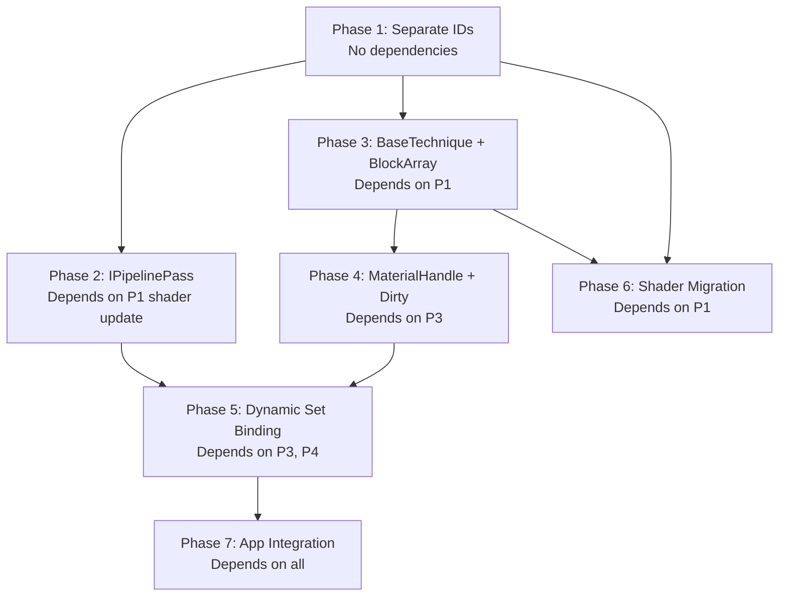

# Implementation Plan: Custom Pipeline Passes & Custom Materials

## Table of Contents

1. [Project Context & Conventions](#1-project-context--conventions)
2. [Implementation Dependency Graph](#2-implementation-dependency-graph)
3. [High-Level Architecture Overview](#3-high-level-architecture-overview)
4. [Issues & Contradictions in Source Plan](#4-issues--contradictions-in-source-plan)
5. [Phase 1: Separate `technique_id` and `material_id`](#5-phase-1-separate-technique_id-and-material_id)
6. [Phase 2: `IPipelinePass` Interface & Custom Pass Infrastructure](#6-phase-2-ipipelinepass-interface--custom-pass-infrastructure)
7. [Phase 3: `BaseTechnique` + `BlockArray` Refactor](#7-phase-3-basetechnique--blockarray-refactor)
8. [Phase 4: `MaterialHandle<T>` + Dirty Tracking + Staging Upload](#8-phase-4-materialhandlet--dirty-tracking--staging-upload)
9. [Phase 5: Dynamic Descriptor Set Binding in Main Pass](#9-phase-5-dynamic-descriptor-set-binding-in-main-pass)
10. [Phase 6: Shader Migration](#10-phase-6-shader-migration)
11. [Phase 7: App-Layer Integration](#11-phase-7-app-layer-integration)
12. [Alternative Approaches & Better Options](#12-alternative-approaches--better-options)
13. [File Map Summary](#13-file-map-summary)
14. [Build System Changes](#14-build-system-changes)

---

## 1. Project Context & Conventions

### 1.1. Build System

The project uses CMake 3.30+ with C++23 modules. The root [`CMakeLists.txt`](../CMakeLists.txt) defines three targets:

| Target | Type | Description |
|--------|------|-------------|
| `VulkanBackend` | STATIC | Backend layer: Vulkan wrappers, render graph, platform |
| `VulkanEngine` | STATIC | Engine layer: rendering, GPU resources, assets, game logic |
| `VulkanApp` | EXECUTABLE | Application entry point |

The engine [`src/engine/CMakeLists.txt`](../src/engine/CMakeLists.txt:1) lists all `.cppm` (module interface) and `.cpp` (module implementation) files explicitly. **Every new file must be registered here.**

Shaders are compiled via the Slang/SPIR-V compiler helper in [`external/SlangSpriVCompilerHelper`](../external/SlangSpriVCompilerHelper/) and registered in the CMake function at [`src/engine/CMakeLists.txt:104-124`](../src/engine/CMakeLists.txt:104).

### 1.2. Code Style (from `.clang-tidy`)

Key conventions from [`.clang-tidy`](../.clang-tidy):

| Element | Convention | `.clang-tidy` key |
|---------|-----------|-------------------|
| Variables | `lower_case` | `readability-identifier-naming.VariableCase` |
| Functions | `CamelCase` | `readability-identifier-naming.FunctionCase` |
| Parameters | `lower_case` | `readability-identifier-naming.ParameterCase` |
| Private members | `lower_case_` (trailing underscore) | `MemberPrefix= '', MemberSuffix='_'` |
| Public members | `lower_case` (no suffix) | `PublicMemberSuffix=''` |
| Classes/Structs | `CamelCase` | `ClassCase=CamelCase, StructCase=CamelCase` |
| Enums | `CamelCase` | `EnumCase=CamelCase` |
| Enum constants | any case | `EnumConstantCase=aNy_CasE` |
| Namespaces | `CamelCase` | `NamespaceCase=CamelCase` |
| Template params | `CamelCase` | `TemplateParameterCase=CamelCase` |

**Important**: The project uses the `modernize-*` checks (minus a few exceptions), `performance-*`, and `bugprone-*`. Use `-Wall -Werror` for Clang/GCC. All public member struct fields need `// NOLINT(misc-non-private-member-variables-in-classes)` comments (as seen throughout the existing code).

### 1.3. Module System

The engine uses C++20 named modules. Module interface files (`.cppm`) have this structure:

```cpp
module;                           // global module fragment

#include <external_dep.hpp>       // only #includes allowed here
// NOLINT(misc-include-cleaner)

export module VulkanEngine.ModuleName;  // module declaration

import std;
import std.compat;
import vulkan_hpp;

export import VulkanBackend.SomeDep;    // re-export if API uses it

export namespace VulkanEngine::SubNamespace {
    // public API
}
```

Module implementation files (`.cpp`) use:
```cpp
module;
// includes...
module VulkanEngine.ModuleName;   // no 'export'
```

### 1.4. Namespace Hierarchy

| Namespace | Location |
|-----------|----------|
| `VulkanEngine::RenderGraph` | [`src/backend/RenderGraph/`](../src/backend/RenderGraph/) |
| `VulkanEngine::RenderPipeline` | [`src/engine/rendering/RenderPipeline.cppm`](../src/engine/rendering/RenderPipeline.cppm) |
| `VulkanEngine::Renderer` | [`src/engine/rendering/Renderer.cppm`](../src/engine/rendering/Renderer.cppm) |
| `VulkanEngine::StandardMeshPipeline` | [`src/engine/rendering/StandardMeshPipeline.cppm`](../src/engine/rendering/StandardMeshPipeline.cppm) |
| `VulkanEngine::MaterialManager` | [`src/engine/rendering/MaterialManager/`](../src/engine/rendering/MaterialManager/) |
| `VulkanEngine::TechniqueManager` | [`src/engine/rendering/TechniqueManager/`](../src/engine/rendering/TechniqueManager/) |
| `VulkanEngine::SceneRenderer` | [`src/engine/rendering/SceneRenderer.cppm`](../src/engine/rendering/SceneRenderer.cppm) |
| `VulkanEngine::GpuResources` | [`src/engine/gpu/GpuResources/`](../src/engine/gpu/GpuResources/) |
| `VulkanEngine::Game` | [`src/engine/core/Game.cppm`](../src/engine/core/Game.cppm) |

---

## 2. Implementation Dependency Graph

The phases are ordered by dependency, but some can be parallelized:



- **Phases 2 and 3 can be developed in parallel** — they touch different systems (render graph vs technique/material)
- **Phase 1 is the critical prerequisite** for everything else
- **Phase 4 depends on Phase 3** (needs `BaseTechnique` and device-local `BlockArray`)
- **Phase 5 depends on Phase 3** (needs `BaseTechnique::GetPipeline/PipelineLayout`) and Phase 4 (needs `MaterialManager` for material IDs)
- **Phase 6 shader changes** are spread across multiple phases (VertEntry rename in P1, fragment shader rewrite in P6)
- **Phase 7 is the integration catch-all** that ties all systems together

---

## 3. High-Level Architecture Overview

### 3.1. Current Data Flow (Before Changes)

```
MeshRenderSystem::ProcessFrame()
  → writes StaticEntry{ indexStart, indexRange, technique_texture, vertexInfo }
  → technique_texture packs (texture_slot << 16) | technique_id

expand.slang (compute):
  → reads StaticEntry.techniqueTexSlot
  → extracts: texSlot = techniqueTexSlot >> 16; techniqueId = techniqueTexSlot & 0xFFFF
  → writes VertEntry{ MVP, maxScale, texSlot }
  → writes CullEntry{ indirOffset, indexCount, techniqueId, pad }

Collect shaders:
  → group by CullEntry.techniqueId
  → write DrawIndirectCommands per technique

main_indir.slang (vertex):
  → reads VertEntry.texSlot → passes as outM to fragment shader

standard_mesh.slang (fragment):
  → uses input.texSlot to index into allTextures[] bindless array

SceneRenderer::Render():
  → loop over techniques by ID
  → drawIndirect per technique
```

### 3.2. Target Data Flow (After Changes)

```
MeshRenderSystem::ProcessFrame()
  → writes StaticEntry{ indexStart, indexRange, technique_id, material_id, vertexInfo }
  → technique_id and material_id are separate uint32 fields

expand.slang (compute):
  → reads StaticEntry.technique_id and StaticEntry.material_id directly
  → writes VertEntry.materialId (pass through to fragment)
  → writes CullEntry.techniqueId (used by collect)

Collect shaders: UNCHANGED

main_indir.slang (vertex):
  → reads VertEntry.materialId → passes as outM to fragment shader

standard_mesh.slang (fragment):
  → uses input.materialId to index into per-material bindless StructuredBuffer

    SceneRenderer::Render():
   → loop over BaseTechnique* pointers
   → dynamic descriptor set binding: engine sets 0-3 always bound, custom sets 4+ per technique
   → drawIndirect per technique
```

---

## 4. Issues & Contradictions in Source Plan

### 3.1. CRITICAL: Lambda-based `modify<T>()` vs RAII Proxy

The source plan has an **internal contradiction**:

- **§2.6 and all code examples** use **lambda-based** `modify<T>([](T& d) { ... })`
- **§8 (Tradeoffs, line 1451-1454)** says the **RAII proxy** (`handle.edit()->roughness = 0.5f`) was **chosen** as the preferred approach

The code throughout the plan consistently implements the lambda approach. The tradeoff section appears to be an un-updated remnant of an earlier draft. **Resolution: The lambda approach is the implemented design.** Use lambda-based `modify<T>()`.

### 3.2. Engine Set Binding: Compacted vs Always-Bound

The plan documents **two conflicting approaches**:

- **§2.2 and §2.8** describe `compacted_slot_[4]` with `UseEngineSet0()` through `UseEngineSet3()` — engine sets are optionally used and compacted into contiguous layout slots, requiring a mapping table and null descriptor unbind logic
- **§8 (Tradeoffs, line 1458-1461)** says compaction was **rejected** in favor of always binding all four engine sets contiguously

#### What's the actual difference?

**Compacted approach (§2.2, §2.8):**
- Each technique calls `UseEngineSet0()` .. `UseEngineSet3()` independently. A technique like `ShadowMapPass` might only use sets 0 and 3 (skipping 1, 2).
- `Compile()` counts enabled engine sets and compacts them to layout slots 0..N-1. The `compacted_slot_[es]` array maps engine set `es` to its compacted layout position, or -1 if unused.
- The render loop uses this mapping: if engine set 3 is compacted to slot 1 (because sets 1 and 2 are absent), it binds at `ds[compacted_slot_[3]]` = `ds[1]`.
- When switching from a technique with 4 engine sets to one with 2, Vulkan's compatibility rules require explicitly unbinding the extra 2 slots (null descriptor sets needed). Incorrect unbinding = undefined behavior per Vulkan spec §13.2.5 "Pipeline Layout Compatibility". The plan's code acknowledges this at source-plan lines 926-933 but hand-waves it with "set a flag that next technique forces a full rebind."

**Always-bound approach (tradeoff §8):**
- Every technique always declares all four engine sets. Pipeline layout slots 0-3 are always engine sets 0-3.
- Custom sets start at layout slot 4 for every technique.
- No compaction, no mapping table, no null descriptor unbind.
- Switching techniques: always bind `{set0, set1, set2, set3}` at slots 0-3, then custom sets at 4+. Vulkan doesn't require rebinding when the set count doesn't change — but since every technique has the same layout structure, there's no mismatch risk.
- Performance impact: if a shader doesn't actually read a set, the GPU simply ignores the bound descriptor. The cost of binding an unused descriptor set is negligible (a handful of GPU command processor cycles).

**Vulkan descriptor set compatibility note:** Per the Vulkan specification, changing pipeline layouts does NOT require all descriptors to be re-bound — only those at positions where the set count changes. Since all techniques in the always-bound approach have engine sets at the same layout positions (0-3), no rebinding of engine sets is needed when switching techniques. Custom sets at positions 4+ must be rebound because different techniques may have different custom set layouts at those positions.

**Why the conflict exists:** The implementation sections were written first assuming techniques **might** need to skip engine sets. The tradeoff section was added later after realizing every technique in practice uses all four engine sets (bindless textures for material lookup, submesh vertex data for submesh info, raw vertex buffers for vertex pulling, indirection buffer for draw indirect — all are fundamental to the engine's GPU-driven pipeline). The compaction code remained in the implementation sections as an un-updated vestige.

**Resolution — always-bound wins:**

1. **Every technique uses all four engine sets** — removing any would break core functionality
2. **Simpler code** — no `compacted_slot_[4]` array, no `first_custom_set_` calculation, no `GetEngineSetMask()`, no null descriptor unbind logic
3. **No Vulkan compatibility pitfalls** — the null descriptor unbind problem disappears because set count never shrinks between techniques
4. **Minimal performance cost** — binding an unused descriptor set is effectively free on modern GPUs
5. **YAGNI** — if a future technique truly needs to skip sets, compaction can be added then in a focused, well-tested manner

**Implementation consequence:** The `UseEngineSet0()`..`UseEngineSet3()` methods and `engine_set_mask_` / `engine_sets_` bitfield members are **removed** from `BaseTechnique`. All custom bindings start at set 4. `BaseTechnique::Compile()` unconditionally includes all four engine set layouts at positions 0-3 in the pipeline layout.

### 3.3. Missing `MaterialParameterBuffer.cppm`

The plan's file map (Part 7, line 1435) lists `MaterialParameterBuffer.cppm` as a file to **remove**. This file **does not exist** in the current codebase. The `MaterialManager` currently stores only `MaterialDefinition` with a single `TextureSlot` and `TechniqueId`. This is a harmless reference to a planned-but-never-created file.

### 3.4. `BaseTechnique` `pipeline_layout_` vs `GraphicsPipeline` `pipeline_layout_`

The plan proposes `BaseTechnique` owning its own `vk::raii::PipelineLayout pipeline_layout_` ([plan §2.2, line 425](../plans/custom_pass_material_inputs.md:425)), but the existing `GraphicsPipeline::CreatePipeline()` also creates and owns a `pipeline_layout_` at [`StandardMeshPipeline.cpp:151`](../src/engine/rendering/StandardMeshPipeline.cpp:151). These would be **duplicate, conflicting pipeline layouts**.

**Detailed problem analysis:**

The current `GraphicsPipeline::Initialize()` at [`StandardMeshPipeline.cpp:23`](src/engine/rendering/StandardMeshPipeline.cpp:23) receives 4 separate raw `vk::DescriptorSetLayout*` pointers (bindless, object_data, raw_vertex, indirection) and stores them as member pointers. It then calls `CreatePipeline()` which at [lines 130-151](src/engine/rendering/StandardMeshPipeline.cpp:130):

1. Selects between `external_layout_` (bindless) or the internal `descriptor_set_layout_`:
   ```cpp
   const vk::DescriptorSetLayout tex_layout = external_layout_ ? *external_layout_ : **descriptor_set_layout_;
   std::vector<vk::DescriptorSetLayout> set_layouts = { tex_layout };
   ```
2. Conditionally appends optional layouts:
   ```cpp
   if (object_data_layout_) set_layouts.push_back(*object_data_layout_);
   if (raw_vertex_layout_) set_layouts.push_back(*raw_vertex_layout_);
   if (indirection_layout_) set_layouts.push_back(*indirection_layout_);
   ```
3. **Hardcodes** push constants to exactly 64 bytes, vertex-only:
   ```cpp
   constexpr std::uint32_t push_constant_size = 64;
   constexpr vk::PushConstantRange push_range(vk::ShaderStageFlagBits::eVertex, 0, push_constant_size);
   ```
4. Creates the layout and stores it in the `pipeline_layout_` member:
   ```cpp
   pipeline_layout_ = std::make_unique<vk::raii::PipelineLayout>(device, layout_info);
   ```

If `BaseTechnique::Compile()` also creates a `VkPipelineLayout`, we'd have **two different layout objects** — the one `BaseTechnique` owns (with custom descriptor sets at set 4+ and correct push constant ranges), and the one `CreatePipeline()` creates internally (without custom sets, hardcoded 64-byte vertex-only push constants). The `VkPipeline` object would reference the layout that `CreatePipeline()` built (via `VkGraphicsPipelineCreateInfo.layout` at line 195), but the render loop would try to bind the layout that `BaseTechnique` owns. **Result: descriptor set binding silently mismatches the pipeline's expected layout.**

**Resolution — `CreatePipeline()` must accept a pre-built layout:**

A new overload of `CreatePipeline()` takes `const vk::PipelineLayout external_pipeline_layout` and passes it directly into `VkGraphicsPipelineCreateInfo.layout` at line 195. The method does **not** create its own `pipeline_layout_`.

`BaseTechnique::Compile()` builds the complete layout:
1. Gathers engine set layouts (sets 0-3) from `SceneRenderer` and `BindlessManager`
2. Groups custom bindings by set number, creates one `vk::DescriptorSetLayout` per custom set
3. Builds `vk::PushConstantRange` entries from declared template instantiations
4. Creates ONE `vk::raii::PipelineLayout` with all descriptor set layouts + push constant ranges
5. Passes this layout to the new `CreatePipeline()` overload

The old `Initialize()` path with member pointers is kept for backward compatibility during migration, since `TechniqueManager::RegisterTechnique()` still uses it until fully migrated to `BaseTechnique`.

### 3.5. `FrameContext::SetPushConstants<T>()` Validation

The plan states push constant ranges are "validated at `Compile()` time" ([plan §1.2b, line 132](../plans/custom_pass_material_inputs.md:132)). But `FrameContext` is constructed per-frame in `Renderer::RenderFrame()`, and `SetPushConstants<T>()` is called during `Execute()`, long after `Compile()` has returned. What gets validated when?

**Three-stage validation:**

**Stage 1 — Declaration (`Setup()`):** When a custom pass calls `ctx.DeclarePushConstants<MyPC>(shader_stages)`, the `PassSetupContext` records the `sizeof(MyPC)` and the `ShaderStageFlags`. This is pure metadata storage — no validation happens here, just recording.

**Stage 2 — Pipeline layout creation (`Compile()`):** When the render graph is compiled, the declared push constant ranges are gathered. Two checks happen:
- `sizeof(T)` is checked against `VkPhysicalDeviceLimits::maxPushConstantsSize` (guaranteed ≥128 bytes by the Vulkan spec). If a technique declares push constants larger than the limit, compilation fails with an error diagnostic.
- Multiple push constant declarations from the same pass are checked for range overlap (debug assert in debug builds).
The valid ranges are then baked into the `VkPipelineLayoutCreateInfo::pPushConstantRanges`. This is what the plan means by "validated at Compile() time" — **device-limit validation**, not type-matching.

**Stage 3 — Runtime debug assert (`Execute()`):** When `FrameContext::SetPushConstants<T>(cmd, src)` is called during pass execution, a **debug-only assert** fires:
```cpp
template<typename T>
void FrameContext::SetPushConstants(vk::CommandBuffer cmd, const T& src) const {
    assert(sizeof(T) == declared_push_constant_size_ &&
           "Push constant type size doesn't match declaration — wrong T?");
    assert(declared_stages_ != vk::ShaderStageFlags{} &&
           "Push constants were never declared for this pass");

    cmd.pushConstants(*pipeline_layout_, declared_stages_, 0, sizeof(T), &src);
}
```
The `declared_push_constant_size_` and `declared_stages_` are populated in the `FrameContext` from the pass's metadata recorded during `Setup()`. This catches programming errors — passing the wrong type `T` to `SetPushConstants` — but is stripped entirely in release builds (zero overhead).

**Complete flow example:**
```
Setup():    DeclarePushConstants<ShadowPC>(Vertex)  → records size=32, stages=vertex
Compile():  validates 32 ≤ maxPushConstantsSize(128) → creates VkPipelineLayout [0..32, vertex]
Frame N:    SetPushConstants(cmd, ShadowPC{light_vp}) → assert(sizeof==32) ✓ → cmd.pushConstants()
```

---

## 5. Phase 1: Separate `technique_id` and `material_id`

### Overview

This phase splits the packed `technique_texture` field in `StaticEntry` into two distinct `uint32` fields. This is the **foundational change** that enables all subsequent phases.

### 4.1. CPU-Side: `MeshRenderSystem.cpp`

**File:** [`src/engine/rendering/MeshRenderSystem.cpp`](../src/engine/rendering/MeshRenderSystem.cpp)

**Current state (lines 144-149):**
```cpp
struct alignas(16) StaticEntry {
    std::uint32_t index_start_packed;
    std::uint32_t index_range;
    std::uint32_t technique_texture;  // packed: (texture_slot << 16) | technique_id
    std::uint32_t vertex_info;
};
```

**Change:** Replace `technique_texture` with two separate fields:

```cpp
struct alignas(16) StaticEntry {
    std::uint32_t index_start_packed;
    std::uint32_t index_range;
    std::uint32_t technique_id;
    std::uint32_t material_id;       // new field — size increases from 16 to 20 bytes
    std::uint32_t vertex_info;
};
// static_assert(sizeof(StaticEntry) == 20, "...");
```

**⚠️ STRUCT SIZE INCREASE:** `StaticEntry` grows from 16 to 20 bytes. However, the `alignas(16)` means it will actually occupy **32 bytes** (padded to 32). The `DynamicEntry` is already 64 bytes (`alignas(16)`, 4 × float4 = 64). The renderer writes these sequentially into `BlockArray` buffers via `EnsureCapacity()` which grows in blocks of 256. The entry size is fixed per `BlockArray` — changing it means the `BlockArray::Config::entry_size` for `compact_static` must be updated.

**Writing logic (lines 188-197):** Replace the packed write:

```cpp
// OLD (lines 192-196):
const auto& mat_def = MaterialManager::MaterialManager::Get().GetMaterial(sm.material_id);
s2->technique_texture =
    (static_cast<std::uint32_t>(mat_def.texture_slot.value) << 16) |
    mat_def.technique_id.value;

// NEW:
const auto& mat_def = MaterialManager::MaterialManager::Get().GetMaterial(sm.material_id);
s2->technique_id = mat_def.technique_id.value;
s2->material_id = sm.material_id.value;  // material_id from SubMesh
```

**Considerations:**
- After Phase 4, `MaterialDefinition` will be replaced with the new `MaterialEntry` system. Until then, `technique_id` comes from `mat_def.technique_id`, and `material_id` from `sm.material_id` (already available in the SubMesh struct).
- The `BlockArray::Config` for `compact_static` in [`SceneRenderer.cpp`](../src/engine/rendering/SceneRenderer.cpp) must have its `entry_size` updated to `sizeof(StaticEntry)`.
- Dynamic mesh entries (lines 218+) also write `StaticEntry` data — same changes apply there.

### 4.2. GPU-Side: `expand.slang`

**File:** [`src/engine/shaders/expand.slang`](../src/engine/shaders/expand.slang)

**Current state (lines 13-18):**
```hlsl
struct StaticEntry {
    uint indexStart;
    uint indexRange;
    uint techniqueTexSlot;   // packed
    uint vertexInfo;
};
```

**Change:** Replace the struct:

```hlsl
struct StaticEntry {
    uint indexStart;
    uint indexRange;
    uint techniqueId;        // now a plain uint
    uint materialId;         // new field
    uint vertexInfo;
};
```

**Reading logic (lines 94-109):** Replace the extraction:

```hlsl
// OLD (lines 94-95, 109):
uint techniqueTexSlot = staticMeshes[...][elemIndex].techniqueTexSlot;
uint texSlot = techniqueTexSlot >> 16;
// ...
cullEntries[...][elemIndex].techniqueId = techniqueTexSlot & 0xFFFFu;

// NEW:
uint techId = staticMeshes[NonUniformResourceIndex(block)][elemIndex].techniqueId;
uint matId  = staticMeshes[NonUniformResourceIndex(block)][elemIndex].materialId;

vertexConstants[...][elemIndex].texSlot = matId;  // was texSlot, now materialId
cullEntries[...][elemIndex].techniqueId = techId;
```

**Key change:** `VertEntry.texSlot` now carries `materialId` (renamed in the shader for clarity). The fragment shader will use this to index into per-material data.

### 4.3. `VertEntry` Struct Update in Multiple Shaders

**Files affected (4 shader files):**

1. [`expand.slang:23-27`](../src/engine/shaders/expand.slang:23):
   ```hlsl
   struct VertEntry {
       float4x4 MVP;
       float maxScale;
       uint texSlot;     // → rename to materialId
   };
   ```

2. [`main_indir.slang:2-6`](../src/engine/shaders/main_indir.slang:2):
   ```hlsl
   struct VertEntry {
       float4x4 MVP;
       float maxScale;
       uint texSlot;     // → rename to materialId
   };
   ```

3. [`depth_indir.slang:2-6`](../src/engine/shaders/depth_indir.slang:2):
   ```hlsl
   struct VertEntry {
       float4x4 MVP;
       float maxScale;
       uint texSlot;     // depth prepass doesn't use this, but struct must match
   };
   ```

**Consistency requirement:** All three shaders must have the **exact same `VertEntry` layout** because they share the same `BlockArray` buffer (written by expand, read by main_indir and depth_indir). Rename the field to `materialId` or keep as `texSlot` — either works as long as all three match.

### 4.4. `main_indir.slang` Vertex Shader Passthrough

**File:** [`src/engine/shaders/main_indir.slang:51`](../src/engine/shaders/main_indir.slang:51)

```hlsl
// OLD:
result.outM = info.texSlot;

// NEW:
result.outM = info.materialId;  // pass material_id through to fragment shader
```

### 4.5. `standard_mesh.slang` Fragment Shader

**File:** [`src/engine/shaders/standard_mesh.slang`](../src/engine/shaders/standard_mesh.slang)

The current shader uses `input.materialId` as a texture index. With Phase 6, it will index into a per-material `StructuredBuffer`. For Phase 1, keep the existing behavior (use it as a bindless texture index) — the shader already expects `materialId : TEXCOORD2`. No change needed in Phase 1.

### 4.6. SceneRenderer BlockArray Config

**File:** [`src/engine/rendering/SceneRenderer.cpp`](../src/engine/rendering/SceneRenderer.cpp)

The `compact_static` `BlockArray` is initialized at [lines 447-449](../src/engine/rendering/SceneRenderer.cpp:447):
```cpp
fr.compact_static.Initialize(be,
    make_block_config(16, BLOCK_ENTRIES, {},          // entry_size = 16 = sizeof(StaticEntry) OLD
        vk::MemoryPropertyFlagBits::eHostVisible |
        vk::MemoryPropertyFlagBits::eHostCoherent));
```

**⚠️ If using the 5-field approach:** Change `16` to `sizeof(StaticEntry)` (which would be 20 or 32 after alignment). The shader's `StructuredBuffer<StaticEntry>` stride must match. Since Slang and C++ may disagree on struct padding for HLSL vs CPU types, there's a real risk of CPU-GPU data mismatch.

**⚠️ Alignment Consideration:** The plan proposes 20 bytes (5 × uint32) with `alignas(16)`. This means each entry occupies 32 bytes in the buffer. The shader's `StructuredBuffer<StaticEntry>` stride is determined by the struct layout in Slang. If Slang packs to 20 bytes but the CPU writes 32-byte-aligned entries, there will be a **mismatch**. This is a hard-to-debug corruption bug.

**Recommended approach — pack material_id into spare bits, keep 16 bytes:**

- `index_start_packed`: hi 8 = index_buf_slot (up to 256 buffers), lo 24 = index_offset (up to 16.7M indices)
- `vertex_info`: hi 8 = vertex_buf_slot, lo 24 = base_vertex → same structure
- `material_id` needs ≤16 bits (max 65535 materials) — sufficient for any scene
- `technique_id` needs ≤16 bits (max 65535 techniques) — sufficient for any engine

```cpp
struct alignas(16) StaticEntry {
    std::uint32_t index_start_packed;  // hi 8 = index_buf_slot, lo 24 = index_offset
    std::uint32_t index_range;
    std::uint32_t technique_material;  // hi 16 = material_id, lo 16 = technique_id
    std::uint32_t vertex_info;         // hi 8 = vertex_buf_slot, lo 24 = base_vertex
};
static_assert(sizeof(StaticEntry) == 16);  // MUST remain 16 bytes
```

Then in `MeshRenderSystem.cpp`:
```cpp
s2->technique_material = (sm.material_id.value << 16) | mat_def.technique_id.value;
```

And in `expand.slang`:
```hlsl
uint techniqueMaterial = staticMeshes[NonUniformResourceIndex(block)][elemIndex].techniqueMaterial;
uint techId = techniqueMaterial & 0xFFFFu;
uint matId  = techniqueMaterial >> 16;
```

This keeps the struct at 16 bytes, requires **zero BlockArray config changes**, and completely avoids CPU-GPU alignment mismatch issues. **This is the recommended approach.**

---

### 4.7. `MaterialId` Widening from `uint16_t` to `uint32_t`

**File:** [`src/engine/rendering/MaterialManager/MaterialId.cppm`](../src/engine/rendering/MaterialManager/MaterialId.cppm)

**Current:**
```cpp
export namespace VulkanEngine::MaterialManager {
    struct MaterialId { uint16_t value; };
}
```

**Change:** Widen to `uint32_t` to support the new material handle system. With the packed approach (§4.6), 16 bits are available in the `technique_material` field for `material_id` (max 65535). However, the CPU-side `MaterialManager` uses `MaterialId.value` as a direct index into a `vector`, and vectors can hold more than 65535 entries.

**Recommendation:** Keep `MaterialId` at `uint16_t` for the packed GPU field but widen the CPU-side type to `uint32_t`. The `MaterialId` sent to shaders via `StaticEntry` must fit in 16 bits — add a runtime assertion in `MeshRenderSystem::ProcessFrame()`:

```cpp
assert(sm.material_id.value <= 0xFFFF && "Material ID exceeds 16-bit GPU limit");
s2->technique_material = (sm.material_id.value << 16) | mat_def.technique_id.value;
```

**Alternative (if >65535 materials needed):** Use the 5-field `StaticEntry` approach with `uint32_t material_id`, which requires the BlockArray config change and alignment handling. Choose based on expected material counts.

---

## 6. Phase 2: `IPipelinePass` Interface & Custom Pass Infrastructure

### Overview

This phase introduces a public extension point for render graph passes and ports the existing hardcoded passes to use the interface internally.

### 5.1. New File: `src/engine/rendering/PipelinePass.cppm`

**Module name:** `VulkanEngine.PipelinePass`

This module exports:

#### 5.1.1. `BuiltinPass` Enum

```cpp
export enum class BuiltinPass : std::uint8_t {
    Expand,
    DepthPrepass,
    HiZGen,
    Occlusion,
    Collect,
    MainPass,
};
```

**Note on naming:** The plan uses `Expand` (no trailing "Pass"). The existing pass names in [`Renderer.cpp:64-175`](../src/engine/rendering/Renderer.cpp:64) are `"expand"`, `"depth-prepass"`, etc. These are the **logical ordering points**, not the actual passes themselves.

#### 5.1.2. `IPipelinePass` Abstract Class

```cpp
export class IPipelinePass {
public:
    virtual ~IPipelinePass() = default;
    virtual void Setup(PassSetupContext& ctx) = 0;
    virtual void Execute(const FrameContext& ctx, vk::CommandBuffer cmd) = 0;
    virtual bool Validate() const { return true; }
};
```

#### 5.1.3. `PassSetupContext` Class

Wraps `RenderPipeline` and `RenderGraphBuilder`. Every method maps to an existing API call.

**Key implementation details:**

| Method | Implementation | Existing API |
|--------|---------------|--------------|
| `ReadDepthBuffer()` | `pipeline_->ImportDepthBuffer()` | [`RenderPipeline.cppm:49`](../src/engine/rendering/RenderPipeline.cppm:49) |
| `ReadBackbuffer()` | `pipeline_->ImportBackbuffer()` | [`RenderPipeline.cppm:48`](../src/engine/rendering/RenderPipeline.cppm:48) |
| `ImportImage(name)` | `pipeline_->ImportImage(name)` | [`RenderPipeline.cppm:50`](../src/engine/rendering/RenderPipeline.cppm:50) |
| `ImportBuffer(name)` | `pipeline_->ImportBuffer(name)` | [`RenderPipeline.cppm:51`](../src/engine/rendering/RenderPipeline.cppm:51) |
| `CreateTransientImage(desc)` | `pipeline_->CreateTransientImage(desc)` | [`RenderPipeline.cppm:52`](../src/engine/rendering/RenderPipeline.cppm:52) |
| `AddRead(res, stage, access)` | `graph_builder_.AddRead(pass, res, stage, access)` | [`RenderGraph.cppm:272`](../src/backend/RenderGraph/RenderGraph.cppm:272) |
| `AddWrite(res)` | `graph_builder_.AddWrite(pass, res)` | [`RenderGraph.cppm:274`](../src/backend/RenderGraph/RenderGraph.cppm:274) |
| `SetPassAttachments(setup)` | `graph_builder_.SetPassAttachments(pass, setup)` | [`RenderGraph.cppm:277`](../src/backend/RenderGraph/RenderGraph.cppm:277) |
| `RunBefore(BuiltinPass)` | Store deferred dep → resolve at `Compile()` | [`RenderGraph.cppm:275`](../src/backend/RenderGraph/RenderGraph.cppm:275) |
| `RunAfter(BuiltinPass)` | Same as above (inverted) | Same |
| `DeclarePushConstants<T>()` | Store size + stage flags → validate at `Compile()` | New |
| `GetRenderWidth/Height()` | Query from RenderPipeline | New |

**`RunBefore`/`RunAfter` deferred resolution:**
The `PassHandle` for the custom pass is not yet allocated when `Setup()` is called (it's created when the pass is added to the render graph). Therefore `RunBefore`/`RunAfter` must **defer** their dependency registration:

1. `Setup()` is called, records "I want to run before `BuiltinPass::MainPass`"
2. `AddCustomPass()` allocates a `PassHandle`
3. At `Compile()` time (or just before), deferred dependencies are resolved to `AddDependency()` calls:
   - `RunBefore(BuiltinPass::X)` → `AddDependency(custom_pass, builtin_handles_[X])`
   - `RunAfter(BuiltinPass::X)` → `AddDependency(builtin_handles_[X], custom_pass)`

#### 5.1.4. `FrameContext` Struct

The `FrameContext` is populated by `Renderer::RenderFrame()` before calling `pipeline_->Execute()`. It wraps access to engine-managed resources:

**Opaque typed handles (in `PipelinePass.cppm`):**
```cpp
export struct BindlessTextureSet  { vk::DescriptorSet handle = nullptr; };
export struct SubmeshVertexSet    { vk::DescriptorSet handle = nullptr; };
export struct RawVertexArray      { vk::DescriptorSet handle = nullptr; };
export struct IndirectionSet      { vk::DescriptorSet handle = nullptr; };
export struct DepthPyramid        { vk::Image image = nullptr; vk::ImageView view = nullptr; };
export struct DepthBufferView     { vk::ImageView view = nullptr; };
```

**Implementation note:** The `FrameContext` is populated in `Renderer::RenderFrame()` from the current `SceneRenderer` state:
- `bindless_textures.handle` = `bindless_mgr_->GetDescriptorSet()` (set 0)
- `submesh_vertices.handle` = `scene_renderer_->GetSubmeshVertexDataLayout()` descriptor set
- `raw_vertex_buffers.handle` = `scene_renderer_->GetRawVertexLayout()` descriptor set
- `indirection_data.handle` = `scene_renderer_->GetIndirectionLayout()` descriptor set
- `depth_pyramid` = `scene_renderer_->GetHizImage()` + `GetHizFullView()`
- `depth_buffer` = from `VulkanBootstrapBackend::GetDepthImageView()`

`SetPushConstants<T>(cmd, src)` validates `sizeof(T)` against the declared push constant range (runtime debug assert if mismatch), then calls:
```cpp
cmd.pushConstants(*pipeline_layout_, stages, 0, sizeof(T), &src);
```

`GetResource(name)` bridges back to resources declared in `Setup()` — maps `ResourceHandle` to actual Vulkan handles that were resolved during `Compile()`.

### 5.2. New File: `src/engine/rendering/PipelinePass.cpp`

Module implementation for deferred dependency resolution and `FrameContext` population.

### 5.3. Modifications to `RenderPipeline.cppm` and `RenderPipeline.cpp`

**File:** [`src/engine/rendering/RenderPipeline.cppm`](../src/engine/rendering/RenderPipeline.cppm)

**Add to `RenderPipeline` class:**

```cpp
// New: register a custom pass
VulkanEngine::RenderGraph::PassHandle AddCustomPass(
    std::unique_ptr<IPipelinePass> pass,
    PassSetupContext& ctx);  // ctx is filled by calling pass->Setup(ctx)

// New: expose built-in pass handles for custom-to-built-in ordering
const std::array<PassHandle, 6>& GetBuiltinHandles() const;
```

**Implementation in [`RenderPipeline.cpp:165`](../src/engine/rendering/RenderPipeline.cpp:165):**
- `AddCustomPass()` calls `pass->Setup(ctx)` to collect resources + dependencies
- Creates the actual `RenderGraphBuilder::AddPass()` entry
- Stores the pass in a `std::vector<std::unique_ptr<IPipelinePass>>` for lifetime management
- Registers deferred dependencies

**Modify `RenderPipelinePassDesc`:**
Add `std::unique_ptr<IPipelinePass> custom_pass` as an optional member (null for built-in pass definitions, non-null for custom passes). The execute lambda for custom passes wraps `pass->Execute(frame_ctx, cmd)`.

### 5.4. Modifications to `Renderer.cpp` — Port Built-in Passes

**File:** [`src/engine/rendering/Renderer.cpp`](../src/engine/rendering/Renderer.cpp)

**Current state:** `Renderer::Initialize()` (lines 36-254) creates 6 passes as lambdas directly in the function body.

**Change:** Each pass becomes a private `IPipelinePass` subclass within `Renderer`. This preserves the existing behavior while making the passes available as `BuiltinPass` ordering points.

**New classes in `Renderer.cppm`** (or a separate `RendererPasses.cppm`):
- `ExpandPass : IPipelinePass`
- `DepthPrepassPass : IPipelinePass`
- `HiZGenPass : IPipelinePass`
- `OcclusionPass : IPipelinePass`
- `CollectPass : IPipelinePass`
- `MainPass : IPipelinePass`
- `ImGuiPass : IPipelinePass`

Each captures its dependencies in `Setup()` and executes in `Execute()`. The `Renderer::Initialize()` method constructs these, calls `pipeline_->AddCustomPass()` for each, then sets up explicit ordering:

```cpp
// In Renderer::Initialize():
auto expand   = pipeline_->AddCustomPass(std::make_unique<ExpandPass>(...), ctx);
auto depth    = pipeline_->AddCustomPass(std::make_unique<DepthPrepassPass>(...), ctx);
// ... etc

builtin_handles_ = {expand, depth, hiz, occlusion, collect, main};
```

**The `SetPassAttachments` for depth/main passes:** These are declared inside each pass's `Setup()`, not in `Renderer::Initialize()`. The pass has access to `PassSetupContext::SetPassAttachments()`.

### 5.5. RenderGraph Changes — Verify, No New Compiler Code Needed

**File:** [`src/backend/RenderGraph/RenderGraphCompile.cpp`](../src/backend/RenderGraph/RenderGraphCompile.cpp)

**Verified:** The topological sort using Kahn's algorithm already exists at [lines 127-148](../src/backend/RenderGraph/RenderGraphCompile.cpp:127). The barrier generation loop at [lines 187-318](../src/backend/RenderGraph/RenderGraphCompile.cpp:187) correctly handles arbitrary read/write declarations. **No changes needed in the render graph compiler.**

The explicit dependency system at [lines 61-75](../src/backend/RenderGraph/RenderGraphCompile.cpp:61) already processes `AddDependency(before, after)` pairs. The resource dependency system at [lines 84-124](../src/backend/RenderGraph/RenderGraphCompile.cpp:84) already builds read-after-write edges.

---

## 7. Phase 3: `BaseTechnique` + `BlockArray` Refactor

### Overview

This phase introduces the `BaseTechnique` class as the foundation for per-technique pipeline layouts and refactors `BlockArray` to support device-local memory for material data.

### 6.1. New File: `src/engine/rendering/TechniqueManager/BaseTechnique.cppm`

**Module name:** `VulkanEngine.TechniqueManager.BaseTechnique`

#### 6.1.1. Core Design

`BaseTechnique` is the abstract base for all rendering techniques. It:
- Declares bindings in its constructor (no Vulkan calls)
- Separately compiles in `Compile()` (creates Vulkan resources)
- Owns its pipeline layout, pipeline, BlockArrays, and shared buffers

**Class outline (namespace `VulkanEngine::TechniqueManager`):**

```cpp
export class BaseTechnique {
public:
    enum class BindingKind : std::uint8_t { PerMaterial, Shared };

    struct BindingDecl {
        std::uint32_t set;
        std::uint32_t binding;
        BindingKind kind;
        std::uint32_t stride = 0;  // PerMaterial only
    };

    virtual ~BaseTechnique() = default;

    TechniqueId GetId() const { return id_; }
    std::span<const BindingDecl> GetBindings() const { return bindings_; }
    size_t GetBindingCount() const { return bindings_.size(); }
    const BindingDecl& GetBinding(size_t i) const { return bindings_[i]; }

    // ── Typed accessors ──
    template<typename T> const T& ReadShared() const;
    template<typename T> void UpdateShared(const T& data,
        GpuResources::StagingManager& staging);
    template<typename T> GpuResources::BlockArray* GetBlockArrayForType();
    GpuResources::BlockArray* GetBlockArray(size_t binding_index);

    // ── GPU resource access ──
    vk::Pipeline GetPipeline() const;
    vk::PipelineLayout GetPipelineLayout() const;

    void Shutdown();

protected:
    // ── Binding declaration (constructor only) ──
    // Custom bindings start at set 4. Engine sets 0-3 are always included
    // in the pipeline layout unconditionally (see §3.2 for rationale).
    template<typename T> void DeclarePerMaterial(uint32_t set, uint32_t binding);
    template<typename T> void DeclareShared(uint32_t set, uint32_t binding);

    // ── Compilation (separate from constructor) ──
    // Creates pipeline layout with engine sets 0-3 + custom sets 4+.
    // Builds one BlockArray per PerMaterial binding, one GpuBuffer per Shared binding.
    void Compile(VulkanEngine::Runtime::VulkanBootstrap& bootstrap,
                 std::span<const uint32_t> vert_spv,
                 std::span<const uint32_t> frag_spv,
                 const StandardMeshPipeline::PipelineConfig& config);

private:
    TechniqueId id_;
    std::vector<BindingDecl> bindings_;
    std::unordered_map<std::type_index, size_t> type_to_binding_;
    std::vector<GpuResources::BlockArray> block_arrays_;
    std::vector<GpuResources::GpuBuffer> shared_buffers_;
    std::vector<std::vector<std::byte>> shared_cpu_data_;

    vk::raii::PipelineLayout pipeline_layout_ = nullptr;
    vk::raii::Pipeline pipeline_ = nullptr;

    void DeclareBindingImpl(BindingDecl decl, std::type_index ti);
    void ValidateNoBindingCollision(uint32_t set, uint32_t binding) const;
};
```

**Key simplifications from source plan:**

1. **Removed `UseEngineSet0-3()` and `engine_set_mask_`** — all techniques unconditionally include engine sets 0-3 at layout slots 0-3. Per §3.2, this avoids the compaction/null-unbind complexity with no practical downside (binding unused descriptor sets costs negligible GPU time). Vulkan does not require rebinding when set counts stay the same; every technique has 4 engine sets, so switching techniques is safe.

2. **Removed `compacted_slot_[4]` and `first_custom_set_`** — no longer needed since engine set layout positions are fixed at 0-3.

3. **Custom bindings start at set 4** — `DeclarePerMaterial<T>(4, 0)`, `DeclareShared<T>(4, 1)`, etc. `ValidateNoBindingCollision` checks for intra-set clashes but different techniques can independently use the same set numbers (they have different pipeline layouts).

#### 6.1.2. `Compile()` Method Implementation

**File:** `src/engine/rendering/TechniqueManager/BaseTechnique.cpp`

**Note on simplification:** Per §3.2, engine sets 0-3 are **always included unconditionally** at layout slots 0-3. There are no `UseEngineSetX()` methods and no compaction logic. Custom bindings start at set 4. Every technique's pipeline layout has the same engine set structure at positions 0-3, avoiding all Vulkan compatibility issues when switching between techniques.

The `Compile()` method:

1. **Determine descriptor set layouts:**
   - Engine sets 0-3 (always present, fixed layout slots 0-3):
     - Set 0: bindless texture layout (from `BindlessManager::GetLayout()`)
     - Set 1: submesh vertex data layout (from `SceneRenderer::GetSubmeshVertexDataLayout()`)
     - Set 2: raw vertex buffer layout (from `SceneRenderer::GetRawVertexLayout()`)
     - Set 3: indirection layout (from `SceneRenderer::GetIndirectionLayout()`)
   - Group custom bindings (set ≥ 4) by set number, create one `vk::DescriptorSetLayout` per custom set
   - The layout slot array = [engine sets 0-3] + [custom set N, custom set N+1, ...]

2. **Create `VkPipelineLayout`:**
   - Assemble all `vk::DescriptorSetLayout` handles into a vector
   - Build push constant ranges from declared constants (template instantiations)
   - Call `vk::raii::PipelineLayout(device, layout_info)`

3. **Create pipeline via `GraphicsPipeline::CreatePipeline()`:**
   - Pass in the pre-built pipeline layout and all descriptor set layouts
   - `GraphicsPipeline` no longer creates its own layout

4. **Create BlockArrays for PerMaterial bindings:**
   - One `BlockArray` per `PerMaterial` binding
   - Config: `entry_size = sizeof(T)`, `entries_per_block = 256`, `memory_mode = DeviceLocal`

5. **Create GpuBuffers for Shared bindings:**
   - One `GpuBuffer` (device-local, storage buffer usage)
   - One `shared_cpu_data_` vector (technique-local CPU buffer for `UpdateShared<T>()`)

#### 6.1.3. `DeclarePerMaterial<T>()` and `DeclareShared<T>()`

These are `protected` methods called in the technique's constructor:

```cpp
template<typename T>
void BaseTechnique::DeclarePerMaterial(uint32_t set, uint32_t binding) {
    ValidateNoBindingCollision(set, binding);
    BindingDecl decl{set, binding, BindingKind::PerMaterial, sizeof(T)};
    DeclareBindingImpl(decl, std::type_index(typeid(T)));
}

template<typename T>
void BaseTechnique::DeclareShared(uint32_t set, uint32_t binding) {
    ValidateNoBindingCollision(set, binding);
    BindingDecl decl{set, binding, BindingKind::Shared, 0};
    DeclareBindingImpl(decl, std::type_index(typeid(T)));
}
```

`DeclareBindingImpl` stores the declaration and the `type_index → binding_index` mapping for O(1) lookup in `GetBlockArrayForType<T>()`.

### 6.2. Refactor `GraphicsPipeline::CreatePipeline()`

**File:** [`src/engine/rendering/StandardMeshPipeline.cpp:111-202`](../src/engine/rendering/StandardMeshPipeline.cpp:111)

**Current signature (line 111):**
```cpp
void GraphicsPipeline::CreatePipeline(VulkanBootstrap& bootstrap,
    const vector<uint32_t>& vertex_spirv,
    const vector<uint32_t>& fragment_spirv,
    const PipelineConfig& config);
```

**Current behavior:** Builds the pipeline layout internally at lines 130-151 using `external_layout_`, `object_data_layout_`, `raw_vertex_layout_`, `indirection_layout_` member pointers. Hardcodes push constant size to 64 bytes, vertex-only stage.

**New signature:**
```cpp
void GraphicsPipeline::CreatePipeline(VulkanBootstrap& bootstrap,
    const std::vector<uint32_t>& vertex_spirv,
    const std::vector<uint32_t>& fragment_spirv,
    const PipelineConfig& config,
    const std::vector<vk::DescriptorSetLayout>& set_layouts,
    const std::vector<vk::PushConstantRange>& push_constant_ranges);
```

**Changes in the body:**
- **Lines 130-151:** Replace the hardcoded set layout assembly with the passed-in `set_layouts` vector. Remove reliance on `external_layout_`, `object_data_layout_`, etc. member pointers.
- **Lines 142-150:** Replace `constexpr vk::PushConstantRange push_range(vertex, 0, 64)` with `push_constant_ranges`.
- **Lines 130-131:** Remove `const vk::DescriptorSetLayout tex_layout = external_layout_ ? *external_layout_ : **descriptor_set_layout_;` — the first layout comes from `set_layouts[0]`.

**Member cleanup:** The `external_layout_`, `object_data_layout_`, `raw_vertex_layout_`, `indirection_layout_` pointers and `descriptor_set_layout_` member become unused. They can be removed once `TechniqueManager` migrates fully to `BaseTechnique`.

**Pipeline creation flow with `BaseTechnique::Compile()`:**
1. `BaseTechnique::Compile()` assembles the full descriptor set layout list
2. Creates a `vk::raii::PipelineLayout` directly via Vulkan API
3. Passes the layout + push constant ranges to `GraphicsPipeline::CreatePipeline()`
4. `GraphicsPipeline` uses them without creating its own layout

**⚠️ Integration concern:** `GraphicsPipeline::Initialize()` ([`StandardMeshPipeline.cpp`](../src/engine/rendering/StandardMeshPipeline.cpp)) currently calls `CreateDescriptorSetLayout()` and `CreateDescriptorPool()`. These need to be refactored or bypassed when called from `BaseTechnique::Compile()`. The cleanest approach: add a new `InitializeWithLayout()` method or make `CreatePipeline()` standalone (decouple from `Initialize()`).

### 6.3. Refactor `BlockArray` for Device-Local Memory

**File:** [`src/engine/gpu/GpuResources/BlockBuffer.cppm`](../src/engine/gpu/GpuResources/BlockBuffer.cppm)
**File:** [`src/engine/gpu/GpuResources/BlockBuffer.cpp`](../src/engine/gpu/GpuResources/BlockBuffer.cpp)

#### 6.3.1. Add `MemoryMode` enum

```cpp
export enum class MemoryMode : std::uint8_t {
    HostVisible,   // existing path: CPU-mapped
    DeviceLocal,   // new path: GPU-resident, upload via staging
};
```

#### 6.3.2. Add `UploadEntry()` method

```cpp
// In BlockArray class declaration:
void UploadEntry(std::uint32_t index, const void* data, std::uint64_t size,
                 GpuResources::StagingManager& staging);
```

**Implementation (in `BlockBuffer.cpp`):**

```cpp
void BlockArray::UploadEntry(uint32_t index, const void* data, uint64_t size,
                              StagingManager& staging) {
    const uint32_t block_idx = index / cfg_.entries_per_block;
    const uint32_t local_idx = index % cfg_.entries_per_block;
    assert(block_idx < blocks_.size());
    assert(size <= cfg_.entry_size);

    const uint64_t dst_offset = static_cast<uint64_t>(block_idx) * BlockSize()
                              + static_cast<uint64_t>(local_idx) * cfg_.entry_size;

    if (cfg_.memory_mode == MemoryMode::DeviceLocal) {
        auto slice = staging.Allocate(size, 256);
        std::memcpy(slice.data, data, size);
        staging.RecordBufferCopy(slice, *blocks_[block_idx].GetBuffer(), dst_offset);
    } else {
        // Host-visible path: direct memcpy
        void* ptr = Get(index);
        if (ptr) std::memcpy(ptr, data, size);
    }
}
```

#### 6.3.3. Add `IsDeviceLocal()` query

```cpp
bool IsDeviceLocal() const { return cfg_.memory_mode == MemoryMode::DeviceLocal; }
```

#### 6.3.4. `GetDescriptorSet()` Method — Currently Missing from BlockArray

The plan references `BlockArray::GetDescriptorSet()` (e.g., in the dynamic binding loop at §8.1, line 1141), but this method **does not currently exist** on `BlockArray`. The plan needs it for the per-technique render loop to bind BlockArray-backed descriptor sets.

**Recommended approach:** Instead of `BlockArray` owning a descriptor set, have `BaseTechnique::Compile()` create a `GpuDescriptorSet` for each custom binding that writes all blocks as a descriptor array. The method `BaseTechnique::GetBlockArrayDescriptor(size_t binding_index)` returns it. This follows the existing `WriteBlocks()` pattern in [`SceneRendererFrame.cpp:38-55`](../src/engine/rendering/SceneRendererFrame.cpp:38).

```cpp
// In BaseTechnique:
struct PerMaterialBinding {
    GpuResources::BlockArray block_array;
    GpuResources::GpuDescriptorSet descriptor_set;  // written when blocks grow
};
std::vector<PerMaterialBinding> per_material_bindings_;
```

**UpdateDescriptorIfNeeded()**: Called after `FlushDirtyMaterials()` and on registration. Checks if block count changed; if so, rewrites the descriptor set with all blocks using `vkUpdateDescriptorSets`.

#### 6.3.5. Config changes

Add `MemoryMode memory_mode` to `BlockArray::Config`:
```cpp
struct Config {
    uint32_t entry_size = 0;
    uint32_t entries_per_block = 256;
    vk::BufferUsageFlags extra_usage = {};
    vk::MemoryPropertyFlags memory = vk::MemoryPropertyFlagBits::eHostVisible
                                    | vk::MemoryPropertyFlagBits::eHostCoherent;
    MemoryMode memory_mode = MemoryMode::HostVisible;  // new default preserves existing behavior
};
```

#### 6.3.6. `AddBlock()` changes

In [`BlockBuffer.cpp:36-58`](../src/engine/gpu/GpuResources/BlockBuffer.cpp:36), when `memory_mode == DeviceLocal`, use `vk::MemoryPropertyFlagBits::eDeviceLocal` instead of `eHostVisible | eHostCoherent`. The mapping will be `nullptr`.

**⚠️ Important:** The current `Get()` method at [line 72](../src/engine/gpu/GpuResources/BlockBuffer.cpp:72) returns `nullptr` if no mapping exists. For device-local blocks, `Get()` must assert or return nullptr (callers must use `UploadEntry()`). Add a debug assert:
```cpp
void* BlockArray::Get(uint32_t index) {
    // ... existing logic ...
    if (!mappings_[block_idx]) {
        assert(!"Get() called on device-local BlockArray — use UploadEntry() instead");
        return nullptr;
    }
    // ...
}
```

### 6.4. Refactor `TechniqueManager` for `BaseTechnique*` Storage

**File:** [`src/engine/rendering/TechniqueManager/TechniqueManager.cppm`](../src/engine/rendering/TechniqueManager/TechniqueManager.cppm)
**File:** [`src/engine/rendering/TechniqueManager/TechniqueManager.cpp`](../src/engine/rendering/TechniqueManager/TechniqueManager.cpp)

**Current [`TechniqueManager::Technique` struct (line 60-62)](../src/engine/rendering/TechniqueManager/TechniqueManager.cppm:60):**
```cpp
struct Technique {
    std::unique_ptr<StandardMeshPipeline::GraphicsPipeline> graphics_pipeline;
};
```

**Change:** Store `BaseTechnique*` alongside (or instead of) `GraphicsPipeline`:

```cpp
struct Technique {
    std::unique_ptr<BaseTechnique> base_technique;
    // Keep legacy GraphicsPipeline for backward compat during migration?
    // Or: BaseTechnique owns the GraphicsPipeline internally.
};
```

**New methods:**
```cpp
// Register a technique by type (the user creates it, passes ownership)
template<typename Tech>
    requires std::derived_from<Tech, BaseTechnique>
TechniqueId Register(std::unique_ptr<Tech> technique);

// Get technique by ID
BaseTechnique* GetTechnique(TechniqueId id);
BaseTechnique* GetTechnique(uint16_t id);

// Legacy support (wraps GraphicsPipeline in a default technique)
TechniqueId RegisterLegacy(VulkanBootstrap& bootstrap,
    const std::vector<uint32_t>& vert_spv,
    const std::vector<uint32_t>& frag_spv,
    const PipelineConfig& config,
    vk::DescriptorSetLayout* set0, vk::DescriptorSetLayout* set1,
    vk::DescriptorSetLayout* set2, vk::DescriptorSetLayout* set3);
```

**⚠️ Migration path:** During the transition, the old `RegisterTechnique()` methods can be kept and internally create a `LegacyTechnique : BaseTechnique` that wraps the old `GraphicsPipeline` flow. This allows incremental migration.

---

## 8. Phase 4: `MaterialHandle<T>` + Dirty Tracking + Staging Upload

### Overview

This phase replaces the simple `MaterialDefinition` system with a typed, technique-aware material system that supports per-material data, dirty tracking, and batched staging upload.

### 7.1. New File: `src/engine/rendering/MaterialManager/MaterialHandle.hpp`

**Type:** Header-only template (cannot be a `.cppm` module because it's templated on the technique type which is user-defined). It will be `#include`d by user code or included in the module via `module; #include "MaterialHandle.hpp"`.

**Key design:**
```cpp
template<typename Tech>
class MaterialHandle {
public:
    template<typename T>
    const T& read() const {
        static_assert(Tech::template HasBinding<T>(),
            "Technique does not declare a PerMaterial binding for this type");
        constexpr size_t off = Tech::template GetOffset<T>();
        return *reinterpret_cast<const T*>(entry_->cpu_data.data() + off);
    }

    template<typename T, typename Func>
    void modify(Func&& func) {
        static_assert(Tech::template HasBinding<T>(),
            "Technique does not declare a PerMaterial binding for this type");
        constexpr size_t off = Tech::template GetOffset<T>();
        constexpr uint32_t binding_idx = Tech::template GetBindingIndex<T>();
        func(*reinterpret_cast<T*>(entry_->cpu_data.data() + off));
        entry_->dirty = true;
        entry_->dirty_bindings |= (1u << binding_idx);
        mark_dirty_(id_);
    }

    MaterialId id() const { return id_; }
    bool valid() const { return entry_ != nullptr; }

    // ... copyable, friend MaterialManager, private constructor ...
private:
    MaterialId id_;
    MaterialEntry* entry_;
    void (*mark_dirty_)(MaterialId);
};
```

**The technique type `Tech` must provide static constexpr members:**
- `template<typename T> static constexpr size_t GetOffset()`
- `template<typename T> static constexpr bool HasBinding()`
- `template<typename T> static constexpr uint32_t GetBindingIndex()`

These are generated manually in each technique class. Future: auto-generate via Slang reflection.

### 7.2. Refactor `MaterialManager.cppm`

**File:** [`src/engine/rendering/MaterialManager/MaterialManager.cppm`](../src/engine/rendering/MaterialManager/MaterialManager.cppm)

**Changes:**

1. **Replace `MaterialDefinition` (line 28-32)** with the new `MaterialEntry`:

```cpp
struct MaterialEntry {
    TechniqueId technique_id{0};
    BlendMode blend_mode{BlendMode::Opaque};
    bool dirty = false;
    uint32_t dirty_bindings = 0;
    std::vector<std::byte> cpu_data;  // PerMaterial bindings only, flat buffer
};
```

2. **Add new members to `MaterialManager`:**
```cpp
std::vector<std::unique_ptr<MaterialEntry>> materials_;  // pointer stability
std::vector<MaterialId> dirty_list_;
std::vector<MaterialId> free_list_;
GpuResources::StagingManager* staging_mgr_ = nullptr;  // set during initialization
```

3. **Remove old members:** `std::vector<MaterialEntry> materials_` (was vector of values, now unique_ptr for stability).

4. **New public methods:**
```cpp
// Typed registration
template<typename Tech, typename... Ts>
MaterialHandle<Tech> Register(BlendMode blend, const Ts&... data);

// Batched upload
void FlushDirtyMaterials();

// Material lifecycle
void Destroy(MaterialId id);

// Read-only access (type-erased)
template<typename T>
const T& Get(MaterialId id) const;
```

5. **Remove old methods:** `RegisterMaterial(const MaterialDefinition&, ...)`, `UpdateMaterialTextureSlot()`, `UpdateMaterialTechnique()`. The old `GetMaterial()` can remain during migration.

### 7.3. `Register<Tech, Ts...>()` Implementation

**File:** [`src/engine/rendering/MaterialManager/MaterialManager.cpp`](../src/engine/rendering/MaterialManager/MaterialManager.cpp)

**Flow:**
1. `static_assert` all data types are trivially copyable
2. Validate arg count matches PerMaterial binding count
3. Validate type order matches technique's binding order
4. Allocate MaterialId (from free_list_ or append)
5. Serialize all `Ts...` args sequentially into `cpu_data` via direct memcpy (all types are POD)
6. Allocate staging slice, memcpy cpu_data, record buffer copies to BlockArrays
7. Create `MaterialEntry*`, store in `materials_`, return `MaterialHandle<Tech>`

**Staging upload during registration** follows the existing pattern from `SceneLoader.cpp` (the plan references lines 297-326). The `StagingManager` API is:
- `staging.Allocate(size, alignment)` → `StagingSlice`
- `staging.RecordBufferCopy(slice, dst_buffer, dst_offset)`
- `staging.Flush()` — called after all registrations or at frame boundary

### 7.4. `FlushDirtyMaterials()` Implementation

**Called at frame boundary** (in `Game::FrameRender()` before `RenderFrame()`).

**Flow:**
1. `if (dirty_list_.empty()) return;` — common case zero-overhead
2. Phase 1: allocate one staging slice per dirty material, memcpy full `cpu_data`
3. Phase 2: per-binding copy — iterate bindings, check `dirty_bindings` mask, only copy dirty bindings
4. `staging_mgr_->Flush()` — submits all recorded copy commands
5. `UpdateDescriptorIfNeeded()` on all BlockArrays — no-op unless blocks grew
6. Clear `dirty_list_`, reset dirty flags

**Per-binding dirty mask:** Each binding is a bit in `dirty_bindings`. When `modify<T>()` sets `dirty_bindings |= (1u << GetBindingIndex<T>())`, only that binding is re-uploaded. This is important for techniques with multiple PerMaterial bindings (e.g., `SkinnedPBRTechnique` with both `MaterialData` and `SkinningData`).

**StagingManager integration:** The `StagingManager` must be accessible from `MaterialManager`. In the current codebase, `StagingManager` is owned by `GameEngine` at [`Game.cpp:49`](../src/engine/core/Game.cpp:49). `MaterialManager` is currently a singleton. The simplest integration: pass `StagingManager&` to `MaterialManager::Initialize()`.

### 7.5. `MarkDirty()` Implementation

```cpp
void MaterialManager::MarkDirty(MaterialId id) {
    auto& entry = materials_[id.value];
    if (entry && !entry->dirty) {
        entry->dirty = true;
        dirty_list_.push_back(id);
    }
}
```

Called by `MaterialHandle::modify<T>()` after the lambda executes. The `!entry->dirty` check ensures each material is added to the dirty list only once per frame (subsequent `modify()` calls on the same material update the dirty_bindings mask but don't re-add to the list).

### 7.6. `Destroy()` Implementation

```cpp
void MaterialManager::Destroy(MaterialId id) {
    materials_[id.value].reset();
    free_list_.push_back(id);
}
```

**ID reuse:** When `Register()` allocates a new ID, it pops from `free_list_` first. The re-registered material immediately overwrites the old GPU slot (no stale data concerns).

---

## 9. Phase 5: Dynamic Descriptor Set Binding in Main Pass

### Overview

The main pass's `SceneRenderer::Render()` loop switches from a uniform descriptor set binding (all techniques use the same sets) to per-technique descriptor sets.

### 8.1. Modify `SceneRenderer::Render()`

**File:** [`src/engine/rendering/SceneRendererFrame.cpp:201-293`](../src/engine/rendering/SceneRendererFrame.cpp:201)

**Current code (lines 275-293):**
```cpp
for (uint16_t t = 0; t < tm.GetTechniqueCount(); ++t) {
    auto* pm = tm.GetGraphicsPipeline(t);
    if (!pm) continue;
    auto* pl = pm->GetPipeline();
    auto* layout = pm->GetPipelineLayout();
    if (!pl || !layout) continue;

    cmd.bindPipeline(vk::PipelineBindPoint::eGraphics, *pl);
    cmd.bindDescriptorSets(vk::PipelineBindPoint::eGraphics, *layout, 0, ds, {});

    const vk::DeviceSize draw_cmd_offset =
        static_cast<vk::DeviceSize>(t) * sizeof(vk::DrawIndirectCommand);
    cmd.drawIndirect(*fr.technique_draw_commands.GetBuffer(),
                      draw_cmd_offset, 1, sizeof(vk::DrawIndirectCommand));
}
```

**New code:**

```cpp
for (uint16_t t = 0; t < tm.GetTechniqueCount(); ++t) {
    auto* tech = tm.GetTechnique(t);  // returns BaseTechnique*
    if (!tech) continue;

    auto pipeline = tech->GetPipeline();
    auto layout = tech->GetPipelineLayout();
    if (!pipeline || !layout) continue;

    cmd.bindPipeline(vk::PipelineBindPoint::eGraphics, pipeline);

    // Build descriptor set array for this technique
    std::array<vk::DescriptorSet, 8> ds{};
    uint32_t slot = 0;

    // Engine sets 0-3 (always bound, per §3.2 resolution)
    ds[slot++] = bm.GetDescriptorSet();                  // set 0: bindless textures
    ds[slot++] = fr.submesh_vertex_set.GetHandle();       // set 1: submesh vertex data
    ds[slot++] = fr.bindless_vertex_set;                  // set 2: raw vertex buffers
    ds[slot++] = fr.indirection_raw_set;                  // set 3: indirection
    // (Note: slot is now 4)

    // Custom sets (BlockArrays + Shared buffers)
    for (size_t bi = 0; bi < tech->GetBindingCount(); ++bi) {
        auto* ba = tech->GetBlockArray(bi);
        if (ba) {
            ds[slot++] = ba->GetDescriptorSet();
        }
    }

    uint32_t total_sets = slot;
    cmd.bindDescriptorSets(vk::PipelineBindPoint::eGraphics, layout,
                            0, {ds.data(), total_sets}, {});

    const vk::DeviceSize draw_cmd_offset =
        static_cast<vk::DeviceSize>(t) * sizeof(vk::DrawIndirectCommand);
    cmd.drawIndirect(*fr.technique_draw_commands.GetBuffer(),
                      draw_cmd_offset, 1, sizeof(vk::DrawIndirectCommand));
}
```

**Key details:**
- Engine sets 0-3 are always at layout slots 0-3 (per §3.2 resolution)
- Custom sets follow starting at slot 4
- Each technique has its own `VkPipelineLayout` — set numbers are per-layout
- The indirection set is rebound to the compacted buffer at lines 216-226 (unchanged)
- `vkCmdBindDescriptorSets` is called per technique — negligible cost for <100 techniques

### 8.2. Depth Prepass Update

**File:** [`src/engine/rendering/SceneRendererFrame.cpp:173-198`](../src/engine/rendering/SceneRendererFrame.cpp:173)

The depth prepass uses its own pipeline layout (`depth_pipeline_layout_`) with engine sets 0-3 bound. The depth prepass does **not** use technique-specific materials (it only reads VertEntry data, no fragment shader). **No changes needed** for the depth prepass after Phase 1's shader update.

### 8.3. DGC Path Removal

**File:** [`src/engine/rendering/SceneRendererFrame.cpp:243-274`](../src/engine/rendering/SceneRendererFrame.cpp:243)

The DGC path (`dgc_available_ == true`) is removed from the main pass. The DGC-related infrastructure in `SceneRenderer` is kept for potential future use (compute passes may still benefit), but the main pass exclusively uses plain `drawIndirect`.

**Files to modify:**
- [`SceneRendererFrame.cpp:243-274`](../src/engine/rendering/SceneRendererFrame.cpp:243): Remove DGC branch (lines 243-274 of the non-DGC path already covers the fallback at lines 275-293)
- [`SceneRendererPipeline.cpp`](../src/engine/rendering/SceneRendererPipeline.cpp): `CreateDegeneratePipeline()` can be removed
- [`SceneRenderer.cppm:119`](../src/engine/rendering/SceneRenderer.cppm:119): Remove `SetupTechniqueDgcCallback()` method declaration
- [`SceneRenderer.cppm:260-265`](../src/engine/rendering/SceneRenderer.cppm:260): Remove DGC member variables (`dgc_available_`, `dgc_commands_layout_`, `dgc_execution_set_`, `dgc_degenerate_layout_`, `dgc_degenerate_pipeline_`)
- [`SceneRenderer.cppm:267`](../src/engine/rendering/SceneRenderer.cppm:267): Remove `dgc_technique_handle_` (subscribes to `on_technique_changed` callback for DGC rebuild — must be properly reset to avoid dangling callback)
- [`Game.cpp:133`](../src/engine/core/Game.cpp:133): Remove `scene_renderer_->SetupTechniqueDgcCallback(*technique_mgr_);` call
- [`degenerate.slang`](../src/engine/shaders/degenerate.slang): Remove from shader compilation list in CMake
- [`collect_write_dgc.slang`](../src/engine/shaders/collect_write_dgc.slang): Can be removed or kept dormant

**⚠️ Important:** Do NOT remove `intermediate_buffer` from `FrameResources` — it is shared between DGC and legacy collect paths (used by both `collect_write_dgc.slang` and `collect_write_legacy.slang`).

### 8.4. SceneRenderer Descriptor Set Type Handling Note

**File:** [`src/engine/rendering/SceneRenderer.cppm:171-174`](../src/engine/rendering/SceneRenderer.cppm:171)

The `indirection_raw_set`, `depth_indirection_set`, `bindless_vertex_set`, and `bindless_index_set` in `FrameResources` are `vk::raii::DescriptorSet` (managed by RAII), NOT `GpuResources::GpuDescriptorSet`. This matters for the new dynamic binding code in §8.1:

- `bm.GetDescriptorSet()` → returns `vk::DescriptorSet` directly (OK as-is)
- `fr.submesh_vertex_set.GetHandle()` → returns `vk::DescriptorSet` (it's a `GpuDescriptorSet`)
- `static_cast<vk::DescriptorSet>(*fr.bindless_vertex_set)` → needed because it's `vk::raii::DescriptorSet`
- `*fr.indirection_raw_set` → needed because it's `vk::raii::DescriptorSet`

The current code at line 237 already uses the correct pattern for all four: `*fr.indirection_raw_set`, `static_cast<vk::DescriptorSet>(*fr.bindless_vertex_set)`. The new dynamic code must preserve these access patterns.

### 8.5. Wire `FlushDirtyMaterials()` into Render Loop

**File:** [`src/engine/core/Game.cpp:301-327`](../src/engine/core/Game.cpp:301)

In `GameEngine::FrameRender()`, add before `renderer_->RenderFrame()`:

```cpp
// Flush dirty material data to GPU before rendering
MaterialManager::MaterialManager::Get().FlushDirtyMaterials();

renderer_->RenderFrame(*ctx.bootstrap, ...);
```

And in `Renderer::RenderFrame()`, after `PrepareCompute()` but before `pipeline_->Execute()`, ensure a `TRANSFER → GRAPHICS` pipeline barrier exists so the staging uploads are visible. This barrier is already handled by the render graph's barrier generation (the render graph compiler inserts barriers based on read/write declarations).

---

## 10. Phase 6: Shader Migration

### Overview

Update all shaders to support the new data layout, then write example technique shaders.

### 9.1. `expand.slang` Changes

Already covered in §4.2-4.3.

### 9.2. `main_indir.slang` Changes

Already covered in §4.3-4.4.

### 9.3. `depth_indir.slang` — `VertEntry` Struct Update

**File:** [`src/engine/shaders/depth_indir.slang`](../src/engine/shaders/depth_indir.slang)

The `VertEntry` struct must match `expand.slang`'s definition. The depth prepass vertex shader reads `VertEntry.MVP` but doesn't use `texSlot`/`materialId`. Rename the field for consistency.

### 9.4. `standard_mesh.slang` — Per-Material StructuredBuffer Indexing

**File:** [`src/engine/shaders/standard_mesh.slang`](../src/engine/shaders/standard_mesh.slang)

**Current (lines 1-18):** Uses `input.materialId` as a direct bindless texture index.

**New version for PBR technique:**

```hlsl
// Set 0: bindless textures (engine standard)
[[vk::binding(0, 0)]] Texture2D<float4> allTextures[];
[[vk::binding(0, 0)]] SamplerState defaultSampler;

// Set 4, binding 0: per-material data (bindless StructuredBuffer array)
struct MaterialData {
    uint albedoS lot;
    uint normalSlot;
    uint metRoughSlot;
    float roughness;
    float metallic;
    float emissiveR, emissiveG, emissiveB;
    float alphaCutoff;
};
[[vk::binding(0, 4)]] StructuredBuffer<MaterialData> materialBuffer[];

// Set 4, binding 1: per-technique shared settings
struct GlobalSettings { float exposure; float gamma; uint flags; };
[[vk::binding(1, 4)]] StructuredBuffer<GlobalSettings> globalSettings;

struct PSInput {
    [[vk::location(0)]] float3 normal : TEXCOORD0;
    [[vk::location(1)]] float2 texCoord : TEXCOORD1;
    [[vk::location(2)]] uint materialId : TEXCOORD2;
};

[shader("fragment")]
float4 main(PSInput input) : SV_TARGET {
    uint block = input.materialId / 256u;
    uint elem  = input.materialId % 256u;
    MaterialData m = materialBuffer[NonUniformResourceIndex(block)][elem];

    float4 albedo = allTextures[NonUniformResourceIndex(m.albedoS lot)]
                  .Sample(defaultSampler, input.texCoord);

    // PBR lighting using m.roughness, m.metallic, etc.
    // Apply globalSettings.exposure, globalSettings.gamma
    return albedo;
}
```

**⚠️ Important:** The original `standard_mesh.slang` is a simple texture-lookup shader. When techniques have different shader binaries, this file becomes the **PBR technique's fragment shader**. Other techniques get their own `.slang` files registered in the CMake shader list.

### 9.5. `collect_write_legacy.slang` — Verified Unchanged

The plan states collect shaders are unchanged. Verified: [`collect_write_legacy.slang`](../src/engine/shaders/collect_write_legacy.slang) reads `TechniqueResult` buffers (offset + count per technique), writes `DrawIndirectCommand` entries. It does not access `StaticEntry` or material data. **No changes needed.**

### 9.6. New Shader Registration

New technique shaders must be added to [`src/engine/CMakeLists.txt:104-124`](../src/engine/CMakeLists.txt:104):

```cmake
# Example: PBR technique shaders
PBRTechniqueVert     pbr_technique.slang     vertex   main
PBRTechniqueFrag     pbr_technique.slang     fragment main
```

Each generates a C++20 module (e.g., `Shaders.Engine.PBRTechniqueVert`) providing `GetSpirvWords()`.

---

## 11. Phase 7: App-Layer Integration

### Overview

Wire everything together in `GameEngine` to demonstrate the new API.

### 10.1. `GameEngine::InitRenderer()` Changes

**File:** [`src/engine/core/Game.cpp:102-179`](../src/engine/core/Game.cpp:102)

**Current:** Creates technique via `technique_mgr_->RegisterTechnique()` with SPIR-V + descriptor set layout pointers.

**New approach (two-phase technique initialization):**

```cpp
bool GameEngine::InitRenderer(ApplicationContext& ctx,
                               span<const uint32_t> vert_override,
                               span<const uint32_t> frag_override) {
    auto& backend = ctx.bootstrap->GetBackend();

    // ... scene_renderer, bindless_mgr setup (unchanged) ...

    technique_mgr_ = std::make_unique<TechniqueManager::TechniqueManager>();

    // ── NEW: Create and compile the PBR technique ──
    auto pbr_tech = std::make_unique<PBRTechnique>();
    // PBRTechnique constructor:
    //   DeclarePerMaterial<MaterialData>(4, 0);
    //   DeclareShared<GlobalSettings>(4, 1);
    // (Engine sets 0-3 are always included automatically — see §3.2)

    // Resolve SPIR-V (same as current code)
    auto vert = resolve_spv(vert_override, vert_spv_holder_);
    auto frag = resolve_spv(frag_override, frag_spv_holder_);

    // Compile: creates pipeline, pipeline layout, BlockArrays, shared buffers
    pbr_tech->Compile(*ctx.bootstrap, vert, frag,
                       config_.pipeline_config);

    pbr_technique_id_ = technique_mgr_->Register(std::move(pbr_tech));

    // ... MaterialManager initialize (unchanged) ...

    // ── NEW: Register materials with typed handles ──
    MaterialManager::MaterialManager::Initialize(&staging_mgr_);

    auto fallback_mat = MaterialManager::MaterialManager::Get()
        .Register<PBRTechnique>(BlendMode::Opaque,
            PBRTechnique::MaterialData{
                .roughness = 0.5f,
                .albedoS lot = fallback_slot,
            });

    // ... renderer setup (unchanged) ...
}
```

### 10.2. `GameEngine::FrameRender()` Changes

**File:** [`src/engine/core/Game.cpp:301-327`](../src/engine/core/Game.cpp:301)

Add before `renderer_->RenderFrame()`:

```cpp
// Upload dirty material data
MaterialManager::MaterialManager::Get().FlushDirtyMaterials();

// Optionally update per-technique shared data:
// pbr_tech->UpdateShared(GlobalSettings{...}, staging_mgr_);
```

### 10.3. `MeshRenderSystem::ProcessFrame()` Changes

Already covered in Phase 1 (§4.1). The `technique_id` and `material_id` are written from `MaterialManager::Get().GetMaterial()`.

**After Phase 4**, the material lookup changes from:
```cpp
const auto& mat_def = MaterialManager::MaterialManager::Get().GetMaterial(sm.material_id);
s2->technique_id = mat_def.technique_id.value;
s2->material_id = sm.material_id.value;
```
to:
```cpp
// With the new system, SubMesh stores material_id directly
s2->technique_id = /* from technique */;
s2->material_id = sm.material_id.value;
```

### 10.4. Example Technique: `PBRTechnique`

This is user code (app layer), not engine code. Example structure:

```cpp
// User code: pbr_technique.hpp
class PBRTechnique : public VulkanEngine::TechniqueManager::BaseTechnique {
public:
    struct MaterialData {
        float roughness = 0.5f, metallic = 0.0f;
        uint32_t albedoS lot = 0, normalSlot = 0, metRoughSlot = 0;
        float emissiveR = 0, emissiveG = 0, emissiveB = 0;
        float alphaCutoff = 0.5f;
        uint32_t _pad = 0;
    };
    static_assert(sizeof(MaterialData) == 40);

    struct alignas(16) GlobalSettings {
        float exposure = 1.0f, gamma = 2.2f;
        uint32_t flags = 0;
    };
    static_assert(sizeof(GlobalSettings) == 16);

    // Compile-time offset table
    template<typename T> static constexpr size_t GetOffset() {
        static_assert(std::is_same_v<T, MaterialData>);
        return 0;
    }
    template<typename T> static constexpr bool HasBinding() {
        return std::is_same_v<T, MaterialData>;
    }
    template<typename T> static constexpr uint32_t GetBindingIndex() {
        static_assert(std::is_same_v<T, MaterialData>);
        return 0;
    }

    PBRTechnique() {
        // Engine sets 0-3 are always automatically included (see §3.2).
        // Custom bindings start at set 4.
        DeclarePerMaterial<MaterialData>(4, 0);
        DeclareShared<GlobalSettings>(4, 1);
    }
};
```

---

## 12. Alternative Approaches & Better Options

### 12.1. Packed `technique_id`/`material_id` vs Separate Fields

**Plan approach:** Separate uint32 fields (Phase 1, §4.1)

**Alternative (recommended, accepted):** Pack both into a single uint32 — hi 16 = material_id, lo 16 = technique_id. This:
- Keeps `StaticEntry` at exactly 16 bytes (no buffer format change)
- Avoids alignment issues with the 20-byte struct
- 16-bit ID range (65535 each) is more than sufficient

**Status: Resolved.** Use the packed approach (detailed in §4.6). ✅

### 12.2. Engine Set Slot Compaction vs Always-Bound

**Plan approach (implementation, §2.2, §2.8):** `compacted_slot_[4]` with optional engine sets

**Alternative (plan's tradeoff §8, accepted):** Always bind all four engine sets at slots 0-3

**Status: Resolved.** Use always-bound. Engine sets 0-3 are always at layout slots 0-3. The `UseEngineSetX()` methods and `compacted_slot_` mapping are removed from `BaseTechnique`. See §3.2 for full rationale. ✅

### 12.3. `GraphicsPipeline` Refactoring Depth

**Plan approach:** Modify `CreatePipeline()` to accept layout + push constants

**Alternative:** `BaseTechnique::Compile()` bypasses `GraphicsPipeline` entirely

**Status: Resolved.** Follow the plan's approach — refactor `CreatePipeline()` to accept a pre-built `VkPipelineLayout`. The existing `GraphicsPipeline` class handles vertex input, rasterization, depth/stencil, blend, and multisample — all still needed. See §3.4 and §6.2 for implementation details. ✅

### 12.4. Material CPU Storage: Single Flat Buffer vs Per-Type Buffers

**Plan approach:** Single flat `cpu_data` vector, bindings concatenated sequentially. `GetOffset<T>()` maps type to byte offset.

**Alternative:** Separate `cpu_data` per binding type (no concatenation)

**Analysis:** The flat buffer approach is simpler for serialization (one memcpy) and enables the 2-phase dirty upload (one staging alloc per material, then per-binding copies with offset). Separate buffers would require multiple allocations.

**Status: Resolved.** Keep the flat buffer approach. ✅

### 12.5. `MaterialHandle` Ownership: Raw Pointer + `unique_ptr` Pool

**Plan approach:** `MaterialHandle` holds `MaterialEntry*` + `MaterialId`. `MaterialEntry` is stored in a `vector<unique_ptr<MaterialEntry>>` for pointer stability.

**Alternative:** `MaterialHandle` stores `MaterialId` only, all access goes through `MaterialManager::Get<T>(id)`

**Analysis:** The handle-with-pointer approach gives direct `read<T>()` access with zero map lookup. The alternative adds a map lookup per `read()`. For hot-path code (render loop reading material data to write to GPU buffers), the pointer approach is faster.

**Concern:** If `MaterialManager` is destroyed while handles exist, dangling pointers result. Mitigation: `MaterialManager` is a singleton with `Shutdown()` called after all handles are out of scope. This is acceptable for an engine with controlled lifecycle.

**Status: Resolved.** Keep the plan's pointer approach with lifecycle documentation. ✅

### 12.6. Per-Material Staging Upload Granularity

**Plan approach:** One staging allocation per dirty material (all PerMaterial bindings copied in one go), then per-binding `RecordBufferCopy` (only dirty bindings copied).

**Alternative:** One staging allocation per dirty binding (multiple small allocations).

**Analysis:** The plan's approach minimizes staging allocations (one per material, not one per binding) while still skipping unchanged bindings. Staging allocations are cheap (bump allocator) but command buffer recording has overhead — fewer `RecordBufferCopy` calls is better.

**Status: Resolved.** Keep the plan's approach. ✅

---

## 13. File Map Summary

### 12.1. New Files

| File | Module | Content |
|------|--------|---------|
| `src/engine/rendering/PipelinePass.cppm` | `VulkanEngine.PipelinePass` | `IPipelinePass`, `PassSetupContext`, `BuiltinPass`, `FrameContext`, opaque handles |
| `src/engine/rendering/PipelinePass.cpp` | (impl) | Deferred dependency resolution, `FrameContext` population |
| `src/engine/rendering/TechniqueManager/BaseTechnique.cppm` | `VulkanEngine.TechniqueManager.BaseTechnique` | `BaseTechnique` class declaration |
| `src/engine/rendering/TechniqueManager/BaseTechnique.cpp` | (impl) | `Compile()`, `UpdateShared<T>()`, `Shutdown()` |
| `src/engine/rendering/MaterialManager/MaterialHandle.hpp` | (header) | `MaterialHandle<Tech>` template |
| `src/engine/shaders/engine_bindings.slang` | (shader) | Shared binding conventions header |

### 12.2. Modified Files

| File | Changes |
|------|---------|
| `src/engine/rendering/MeshRenderSystem.cpp` | New `StaticEntry` fields (Phase 1) |
| `src/engine/rendering/StandardMeshPipeline.cppm` | (minor) Add `PipelineConfig` extensions if needed |
| `src/engine/rendering/StandardMeshPipeline.cpp` | Refactor `CreatePipeline()` to accept layout + push ranges |
| `src/engine/rendering/Renderer.cppm` | Add `builtin_handles_[]`, expose pass classes |
| `src/engine/rendering/Renderer.cpp` | Port built-in passes to `IPipelinePass`, populate `FrameContext` |
| `src/engine/rendering/RenderPipeline.cppm` | Add `AddCustomPass()`, `GetBuiltinHandles()` |
| `src/engine/rendering/RenderPipeline.cpp` | Implement custom pass integration |
| `src/engine/rendering/SceneRendererFrame.cpp` | Dynamic descriptor set binding, remove DGC branch |
| `src/engine/rendering/SceneRenderer.cpp` | `BlockArray` config updates |
| `src/engine/rendering/MaterialManager/MaterialManager.cppm` | Replace `MaterialDefinition` with `MaterialEntry`, new `Register<Tech,Ts...>()`, `FlushDirtyMaterials()` |
| `src/engine/rendering/MaterialManager/MaterialManager.cpp` | Implement new methods |
| `src/engine/rendering/TechniqueManager/TechniqueManager.cppm` | Store `BaseTechnique*`, add `Register<Tech>()`, `GetTechnique()` |
| `src/engine/rendering/TechniqueManager/TechniqueManager.cpp` | Implement new methods, legacy wrapper |
| `src/engine/gpu/GpuResources/BlockBuffer.cppm` | Add `MemoryMode`, `UploadEntry()`, `IsDeviceLocal()` |
| `src/engine/gpu/GpuResources/BlockBuffer.cpp` | Implement device-local path |
| `src/engine/core/Game.cppm` | Expose `BaseTechnique`, `MaterialHandle` includes |
| `src/engine/core/Game.cpp` | Two-phase technique init, `FlushDirtyMaterials()` call |
| `src/engine/shaders/expand.slang` | New `StaticEntry`, separate ID reads |
| `src/engine/shaders/main_indir.slang` | `VertEntry.materialId` passthrough |
| `src/engine/shaders/depth_indir.slang` | `VertEntry` struct sync |
| `src/engine/shaders/standard_mesh.slang` | Per-material `StructuredBuffer` indexing |
| `src/engine/CMakeLists.txt` | Add new `.cppm`/`.cpp` files, update shader list |

### 12.3. Removed Files (or Dead Code)

| File | Reason |
|------|--------|
| `src/engine/rendering/SceneRendererPipeline.cpp:CreateDegeneratePipeline()` | DGC removed from main pass |
| `src/engine/shaders/degenerate.slang` | DGC degenerate pipeline shader (if DGC fully removed) |
| `src/engine/shaders/collect_write_dgc.slang` | DGC write path (if DGC fully removed) |
| `src/engine/rendering/MaterialManager/MaterialParameterBuffer.cppm` | Never existed (plan reference error) |

---

## 14. Build System Changes

### 13.1. New Module Files Registration

In [`src/engine/CMakeLists.txt`](../src/engine/CMakeLists.txt):

**Add to `.cppm` FILE_SET (around line 132):**
```cmake
rendering/PipelinePass.cppm
rendering/TechniqueManager/BaseTechnique.cppm
```

**Add to `.cpp` sources (around line 64):**
```cmake
rendering/PipelinePass.cpp
rendering/TechniqueManager/BaseTechnique.cpp
```

### 13.2. Shader Registration

If new technique shaders are created:
```cmake
add_slang_shaders(
    TARGET      ${ENGINE_TARGET}_shaders
    # ... existing config ...
    SHADERS
        # ... existing shaders ...
        # New technique shaders (example):
        # PBRTechniqueVert     pbr_technique.slang     vertex   main
        # PBRTechniqueFrag     pbr_technique.slang     fragment main
)
```

### 13.3. Dependencies

No new external dependencies. The existing `vcpkg.json` dependencies (Vulkan, KTX, glm, tinyobjloader, fastgltf, imgui) are sufficient.

---

## Appendix A: Key Vulkan API Constraints

1. **Pipeline layout compatibility:** Each technique has its own `VkPipelineLayout`. Set slot numbers are per-layout. `vkCmdBindDescriptorSets` rebinds all sets when switching techniques.

2. **Descriptor set limit:** Vulkan guarantees at least 4 bound descriptor sets. The engine uses sets 0-3 for engine standard sets + custom sets at 4+. For techniques with many custom sets (>4 beyond engine sets), test against `VkPhysicalDeviceLimits::maxBoundDescriptorSets`.

3. **Push constant limit:** `VkPhysicalDeviceLimits::maxPushConstantsSize` is at least 128 bytes. The engine currently uses 64 bytes for vertex shader. Techniques declaring push constants must stay within this limit.

4. **BlockArray descriptor set updates:** When a `BlockArray` grows (new block allocated), its descriptor set must be rewritten. This only happens every 256 material registrations per binding — amortized cost is negligible.

---

## Appendix B: Migration & Rollback Strategy

This is a **backward-incompatible** change. To manage risk:

1. **Phase 1 can ship independently** — splitting `technique_texture` into two fields is a self-contained change that enables future phases without breaking anything.

2. **Phases 2-5 should ship together** — the `IPipelinePass` refactor touches the render graph setup, and `BaseTechnique` touches the pipeline creation path. These are tightly coupled.

3. **Legacy technique support** — Keep the old `TechniqueManager::RegisterTechnique()` methods with a `LegacyTechnique` adapter during the transition. This allows existing code to work while new techniques adopt `BaseTechnique`.

4. **Shader registry** — Old shader `.slang` files can coexist with new ones. The CMake shader list controls what gets compiled.

---

## Appendix C: Testing Strategy

1. **Unit tests** (in `tests/`):
   - `BaseTechnique` binding declaration and collision detection
   - `MaterialHandle<T>` read/modify cycle with static_assert validation
   - `MaterialManager` register → modify → flush → read-back flow
   - `BlockArray` device-local upload and capacity growth

2. **Integration tests:**
   - Render a scene with one technique, one material → verify no visual regression
   - Register 300+ materials, modify random ones → verify dirty list correctness
   - Custom pass inserted between built-in passes → verify execution order via debug markers

3. **Validation layer checks:**
   - No descriptor set binding errors
   - No pipeline layout compatibility warnings
   - No push constant range overlap errors
